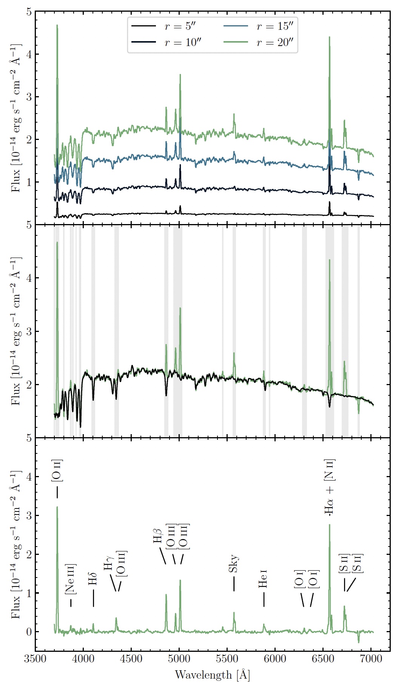
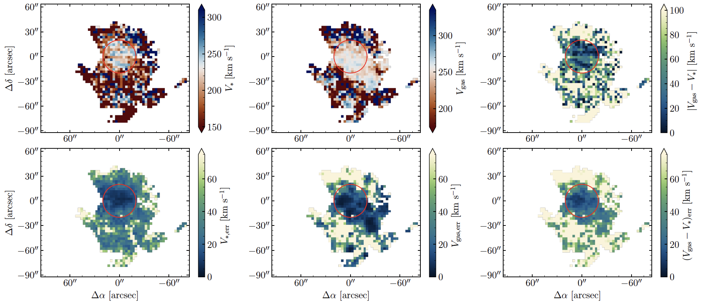
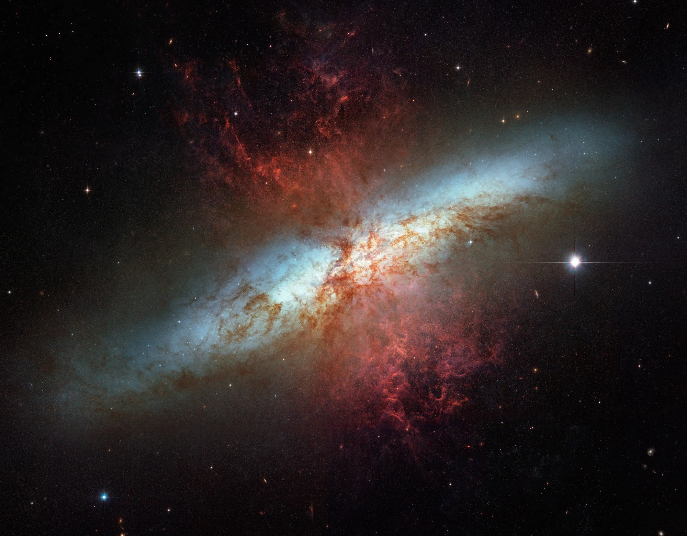

Almost two years ago when I was writing up [my PhD thesis](), I needed to write up a "Conclusions and Future Work" chapter. The conclusions were straightforward, but coming up with an idea of things I can do in the far off future was hard. I think any scientist would tell you that doing the science is usually the easy part; coming up with the idea in the first place is the hard part!

But throughout my thesis which focused primarily on the nearby giant spiral galaxy M101, known as the Pinwheel Galaxy, I kept turning my attention to its companion dwarf galaxies. The biggest of these doesn't have a cute name, but is intead known by its catalog number, NGC 5474. And just like M101, NGC 5474 is peculiar! Optically, it looks like a typical dwarf spiral galaxy with loose spiral arms and numerous sites of star formation. That is, except for its central bulge being offset to the north! 

This galaxy really caught my attention, but sadly, I didn't have time for it in my thesis to do a deep dive on it as much as I had M101. This was a perfect candidate for some of that "future work," to figure out what's going on with that offset bulge. Recently, a [group of astronomers in Italy](https://ui.adsabs.harvard.edu/abs/2020A%26A...634A.124B/abstract) performed some photometry of the bulge to look at resolve stellar populations, basically seeing what types of stars were in the bulge and the surrounding disk of NGC 5474. Based on that data, they proposed that the bulge of NGC 5474 could actually be a dwarf elliptical galaxy orbiting around the disk of NGC 5474 instead of being a bulge in the plane of the disk as is the case for normal galaxies. 

How can you tell that for sure? Well, you'd need spectroscopy. Spectroscopy is a tool that allows you to see how much light of each individual wavelength there is in an object called a spectrum. Astronomers (and physicists and chemists) have put a lot of work into understanding spectra and what sorts of objects produce the different wavelengths of light. For example, star-forming regions that are full of gas ionized by hot, young stars produce "emission lines", things like ionized hydrogen, oxygen, nitrogen, sulfur, etc. Meanwhile, stars have elements in their stellar atmospheres that absorb light before it can leave the star, so stars have "absorption lines", like hydrogen, magnesium, iron, calcium, etc. 

So for our case of NGC 5474, if we can take the spectrum of the bulge area, we'll see a spectrum likely composed of both emission lines and absorption lines. Thankfully, we're not the first people to do this in general, so we know that the disks of galaxies are where the star-forming regions lie that produce the emission lines. Meanwhile, elliptical galaxies which don't tend to have any ionized gas should produce mostly the absorption lines produced by populations of stars. 

One more thing to consider. If an object is moving away from us, its light will be at wavelengths shifted from what we measure here on Earth in our labs. This is the well-known [Doppler effect](https://youtu.be/cVy428N3s5A?si=2p7BCXfWN0vBHePe&t=49) that you probably have lots of experience when an emergency vehicle passes you on the road. As it approaches you, the sounds waves coming from its sirens are squished together and you hear a higher pitch. As it races away from you, the sound waves are spread apart and you hear a lower pitch. Light waves do this too and we call this being blueshifted and redshifted, respectively. 

What does that mean for our spectroscopy of the bulge and disk of NGC 5474? Well, if there is a wavelength offset between the absorption lines in the bulge and the emission lines in the disk, then that indicates a velocity offset as well. A velocity offset would be a strong indication that the bulge and disk are two separate objects! 

All of this was proposed by that group of Italian astronomers in [Bellazzini et al. (2020)](https://ui.adsabs.harvard.edu/abs/2020A%26A...634A.124B/abstract). Sadly, I did not have any spectroscopy of NGC 5474. There was one collaboration called [PINGS](https://ui.adsabs.harvard.edu/abs/2010MNRAS.405..735R/abstract)[^1] that would have covered NGC 5474 in their spectroscopic survey, but they hadn't released the data for this galaxy yet. Oh well. I'd have to go out and collect this spectroscopy at some far off date. Who knows when that'll be? I wrote it up this idea and got to work defending my thesis. 

[But you know what? I'm coming back for you, baby! I'm coming back for you!](https://youtu.be/Sy0A0pQmGPM?si=fm_Ei2eQYaAPyMCA&t=172)[^2]

Barely a year after my thesis, and after I had picked up everything to start my new postdoc position at Texas A&M, I figured I could try and answer this question. So I worked up the courage to cold email the head of the PINGS collaboration and see if they were planning on doing anything with their spectroscopic data of NGC 5474. Thankfully, the head, Fabián Rosales-Ortega was more than happy to share the data with me! Yes! I could now try and figure out what the nature of this peculiar offset bulge is. 

What did this data look like? Well it's a special kind of spectroscopic dataset called "integral field spectroscopy" or IFS. Basically, instead of throwing down a thin slit on a galaxy and being able to only collect the light in that slit, IFS is like taking a larger picture of a galaxy at each wavelength of light. The result is a "data cube", a 2D picture of the galaxy with a spectrum in each pixel. That means that not only do we have spectral information, we could also see how the spectra vary across the galaxy!

Or at least, that's the idea in theory. In practice, things can go wrong. The PINGS survey collected IFS data on many galaxies, but out of all of them NGC 5474 was the only one who's data collection was compromised. This galaxy's data was collected not by Fabián, but by the folks who manage the observatory. Due to no fault of their own, this meant that the accuracy of the data was not up to par across the entire galaxy. But! The region around the bulge was of good quality and that's all we needed for this project. 

Now, how do we actually extract the spectra and measure their (potentially offset) wavelengths? There were two basic methods that we tried. The first is to just sum up all of the light in some circular apertures centered on the bulge. This has the benefit of increasing the signal-to-noise ratio of the data. The second method is to use the entire 2D dataset to produce velocity maps, so we can more easily see where velocities are different and where they're the same. 

I'm not going to go into all of the details of how we actually do this (that's what [the paper](https://arxiv.org/abs/2502.21188) is for!), but I'll show you some interesting results. 

First up are the circular apertures. We did this in a series of circular apertures ranging from relatively small that encompassed only a fraction of the bulge up to a large aperture that gets the entire bulge. We did this because the smaller aperture minimizes "contamination" from the underlying disk while the largest aperture maximizes the signal-to-noise at the expense of containing more of the underlying disk. Below, you can see the spectra for each aperture in varying shades of blue and green. 

In each spectra, you can see both absorption and emission lines. If we focus on the largest aperture which is shown by itself in the middle panel, you can more clearly see these two features. The black line is a fit to the stellar population and its absorption lines, those parts that have lower fluxes at a particular wavelength. You can also see the emission lines sitting on top of the absorption line spectrum. Subtracting away the absorption line spectrum gives you just the emission lines in the bottom panel. These lines are very familiar to astronomers who study star-forming regions. We see lines of ionized hydrogen, oxygen, nitrogen, sulfur, and even ionized neon!

Now we just need to estimate the velocity offset for the emission and absorption lines separately. Remember, the absorption lines are likely being produced by stars in the bulge, while the emission lines are being produced by star-forming regions in the disk. When we estimate the velocity of the absorption lines, we get approximately 230 km/s. Doing the same for the emission lines gives a velocity of approximately 255 km/s. That's a velocity difference of 25 km/s! 

Alright, but that's just for some circular apertures. If we use each pixel in the data, each containing its own spectrum, what do we get for the velocities across the entire datacube? I won't bore you with the details, but we can produce velocity *maps* that show how the velocities in the absorption lines and emission lines change across the entire dataset. 

In the above figure, we'll focus on the top row (the bottom row contains the uncertainties on the velocity measurements). In all of the plots, the red circle is the position and size of the bulge. The left plot is the velocity of the stars, i.e., measured from the absorption lines. You can see that the bulge is pretty coherent, all around the same velocity of about 230 km/s. The middle plot shows the velocity of the ionized gas, i.e., measured from the emission lines. There's a much larger area that is of the same velocity, but importantly this area contains the bulge at a velocity of about 250 km/s. Finally, the right plot shows the velocity difference and the bulge stands out clearly! Spatially resolved, the bulge has a velocity difference between 20 and 40 km/s, very similar to the result from the circular apertures!

Now, just because we've measured a velocity difference of about 25 km/s, doesn't mean these two objects are separate. We need to put this measurement in the context of similar measurements and see if any other explanation is plausible. 

First, the gas and stars in normal galaxies don't have a large velocity difference. For example, in [one survey](https://ui.adsabs.harvard.edu/abs/2013A%26A...557A.130M/abstract) of 30 isolated spiral galaxies, a velocity difference of only 2 km/s was found, ten times lower than what we've measured in NGC 5474. 

Maybe we're measuring some sort of gaseous outflow from the disk? If you look at galaxies that have intense rates of star formation, like the Cigar Galaxy (M82), you see that gas is being pushed out perpendicular to the plane of the disk by rapid star formation and all those strong stellar winds. Since NGC 5474 is face-on and not edge-on like M82, maybe we're just looking straight down the barrel of this funnel of gas. Well, NGC 5474 is not a starbursting galaxy. It has a meager star formation rate, and it doesn't have an active supermassive black hole at the center that could push gas out either. 

It does look like this velocity difference between the bulge (absorption lines) and disk (emission lines) is real and isn't caused by some of the more common explanations. This galaxy, which has been seen as just one peculiar galaxy, looks like it is instead a superposition of two galaxies! The fact that we don't see any debris from an interaction (no long streams of stars, no huge burst of star formation, no wildly distorted velocity maps) likely says that these two objects are in the process of weakly interacting with each other. 



The larger question remains: how does this all connect to M101? I've buried the lede, but approximately 300 million years ago, [M101 and NGC 5474 interacted](https://ui.adsabs.harvard.edu/abs/2022ApJ...933L..33L/abstract). NGC 5474 swung by M101, close enough to distort M101 and create that "big wonky arm" as I have grown to call it. We thought that the interaction also might have shifted the bulge of NGC 5474 north, but our new results seem to indicate otherwise. Clearly that close passage with M101 didn't unbind the bulge-disk pair of NGC 5474, or maybe the bulge is a more recent addition? Honestly, we don't know for sure. All I know is that someone needs to do some dynamical modeling of this three-body interaction, something that is famously difficult. 

That's all I've got for you! I am very happy that I got to put some words down about this project and even happier that I got to investigate this peculiar little galaxy. This only goes to show that even the smallest galaxies are curiosities unto themselves! 

[^1]: PINGS stands for the PPak IFS Nearby Galaxies Survey, an acronym that contains *two acronyms* in it! 
[^2]: Yep, I really did include this line as the opening quote to the final chapter of my thesis!