One of the big surveys in astronomy is the [Sloan Digital Sky Survey (SDSS)](https://www.sdss.org/). Although it's "old" by today's standards, having started data collection in the far-off year of 2000, this survey was groundbreaking. It would survey the sky and take pictures in several different filters, resulting in the imaging of billions of objects. They also followed up with spectroscopy, taking the light from a distant object and splitting it up along wavelength to produce spectra; they did this for several million objects. And the science folks have done with this data is astounding, from looking at distant quasars in the early universe, the cosmological distribution of galaxies and large scale structure, to the properties of stars in our own Galaxy. SDSS was truly revolutionary. 

Every few years, SDSS gets upgraded. Maybe a specialized set of targets, maybe a new set of filters, maybe a new instrument. For instance, in 2005, SDSS started the [Sloan Extension for Galactic Understanding and Exploration (SEGUE)](https://www.sdss4.org/surveys/segue/) aimed at spectroscopy of stars in our Galaxy to make a 3D map. In 2014, SDSS started the [Mapping Nearby Galaxies at APO (MaNGA)](https://www.sdss4.org/surveys/manga/) survey, a two-dimensional spectroscopy survey of nearly 10,000 nearby galaxies to study their star-forming regions. Most recently, SDSS was upgraded again, this time with the [Local Volume Mapper (LVM)](https://www.sdss.org/dr19/lvm/) (see also [Drory et al. (2024)](https://arxiv.org/abs/2405.01637)), another two-dimensional spectroscopic survey to target nearby galaxies to study their star-forming regions in detail. 

That's where I come in. I study emission lines for a living, particularly those produced in star-forming regions in other galaxies. Briefly, take the Orion Nebula for example, a star-forming region in our own Galaxy. It once was just a cloud of gas and dust, but eventually it collapsed under its own weight to form a new generation of stars. Of those newly formed stars, the hottest and most massive stars emit a lot of ultraviolet light that radiates outwards. Those photons of light hit any gas that has not yet formed stars, heating it up, exciting it, which causes the gas to emit its own light. We see that light as emission lines, lots of light at very particular wavelengths. For example, hydrogen has a series of emission lines in the optical called the Balmer lines: the brightest is called H&alpha; (H-alpha), emitting at a wavelength of 6562 Å. The next brightest is H&beta; (H-beta), emitting at a wavelength of 4861 Å. Other elements emit at other wavelengths dependent on their atomic structure. Singly-ionized oxygen (that is, oxygen with one electron removed) emits a lot of light at 3727 Å. Doubly-ionized oxygen (that is, oxygen with two electrons removed) emits two bright emission lines at 4959 Å and 5007 Å. 

<figure>
  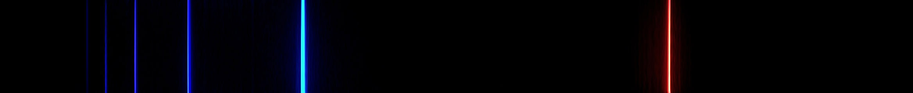
  <figcaption>The visible hydrogen emission lines. H&alpha; is the red line at the right, H&beta; is the cyan line in the middle, H&gamma; is the next blue line, etc.</figcaption>
</figure>

From these emission lines and their relative strengths (how bright they are compared with one another), we can learn a lot about the gas emitting them. We can learn about the abundance of elements in the gas, how highly ionized the gas is, the density of the gas, the temperature of the gas, so many things! 

What's the point of me telling you all of this? Although the LVM has started to collect data, they've only [released one set of data](https://www.sdss.org/dr19/lvm/tutorials/) so far: the Helix Nebula (NGC 7293; see [Sánchez et al. (2026)](https://arxiv.org/abs/2602.10072)). Unlike what I study, star-forming regions, the Helix Nebula is a planetary nebula in our own Galaxy. Planetary nebulae (which have nothing to do with planets or planet formation) are the sites of dead stars. When a star about the mass of our Sun dies, it will shed off the outer layers of its atmosphere, exposing its central hot core. We call that core a white dwarf. The white dwarf is very very very hot and emits a lot of ionizing light. That light will ionize what once was the star's atmosphere and cause it to emit its own light, which we see as the nebula. Here's the fun part: since there's really only one star doing the ionizing, we'll get a stratification of ionization: the highly ionized atoms and their light will be concentrated towards the center, with less ionized atoms and their light further out. 

Alright, that's enough introduction. Let's see some data! 

## The Local Volume Mapper

The Local Volume Mapper instrument is what's called an "integral field spectrograph" or IFS. These are fiber-fed instruments where each optic fiber collects light from a particular part of the sky. You can imagine it this way: for a given object, cover that object in small circles. Each circle is a fiber that is collecting the light only in that circle. The collection of those circles is the spectrograph and together we have not only spectroscopic information in single fibers, but spectroscopic information across a two-dimensional area. The plot below shows the fiber layout for this data of the Helix Nebula. 

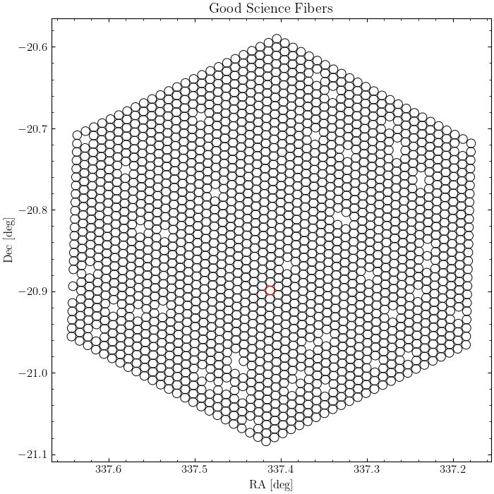

All of those circles are the individual fibers! Now, there are some holes. As the title of the plot suggests, I've only shown the "good" science fibers. The holes might be fibers that didn't collect data, collected "bad" data (such as a star), or something was just wrong with the mechanical operation of that fiber. No worries, we've still got a lot of good fibers with good data. 

Speaking of data, we can use this to extract spectral information about the Helix Nebula. For instance, if we select the region around the H&alpha; line, we can make an "image" of the nebula at this wavelength. 

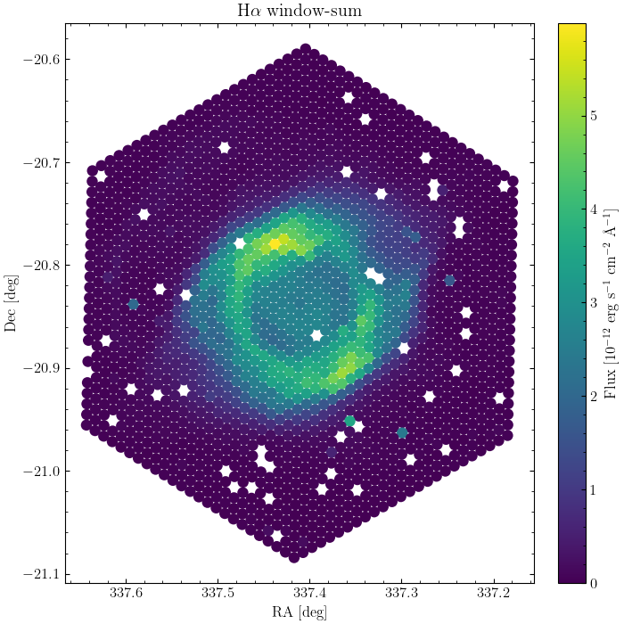

Ta-da! The Helix Nebula! Compare this plot to the image at the beginning of this post from the Hubble Space Telescope. Can you see the similar structures? 

## Integrated Spectrum

One of the simplest things to do with an integral field spectrograph is to ignore the two-dimensional information and just add together the light from every fiber. This produces an "integrated" spectrum: the spectrum of the entire object. There's a statistical benefit to doing this as well: since we're adding up the light from a lot of fibers (1,754 fibers to be exact), the uncertainty in our measurements goes down. We'll also be able to more clearly see faint emission lines, many of which are important to determine the physical quantities of the nebula. And we can see a lot of the lines! Not only are these observations from the LVM deep (meaning they stare at the object for a while), they sample a long wavelength range from the very blue optical light into the near-infrared (3600 - 9800 Å, in case you're curious).

A quick note about emission line labeling. There are two types of emission line labeling, permitted and forbidden lines. Permitted lines are called permitted because they easily happen in labs here on Earth. In the plot below, these are lines without square brackets around them, such as the hydrogen lines H&alpha;, H&beta;, H&gamma;, etc. Forbidden lines are called forbidden because they don't happen easily in labs on Earth; they require the extremely low densities of outer space to happen. In the plot below, these are the lines with square brackets around them. Take [O III] for instance. The "O" is the chemical symbol for that atom, in this case oxygen. But what are those Roman numerals doing there? That indicates the degree of ionization, i.e., how many electrons are missing. We call neutral "I", so singly-ionized is "II", doubly-ionized is "III", triply-ionized is "IV", etc. So "[O III]" tells us that this is a forbidden line of doubly-ionized oxygen! Similarly "[S II]" tells us that we have a forbidden line of singly-ionized sulfur. Finally, when referring to an emission line without the aid of a plot, we often write the wavelength of the line. So we might say "[O III]&lambda;5007" to say that the wavelength of this line is at 5007 Å to distinguish it from another [O III] emission line. 

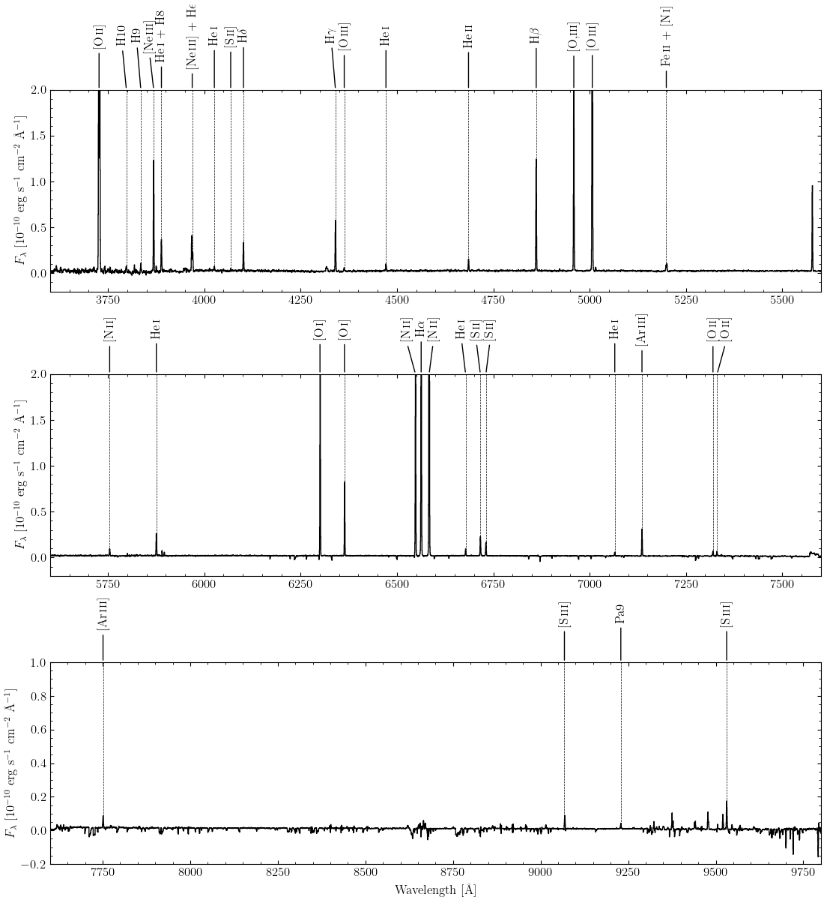

Looking at the plot above, we see numerous strong and weak lines. (Note that I've cut off the $y$-axes; the strong lines extend above the plot.) Some of the strongest lines in nebulae are those of oxygen, hydrogen, nitrogen, and sulfur, such as [O II]&lambda;3727, [O III]&lambda;&lambda;4959,5007, H&beta;, H&alpha;, [N II]&lambda;&lambda;6548,6584, and [S II]&lambda;&lambda;6717,6731. See if you can identify them on the plot! 

There are also a lot of faint lines. Some of these are very important for determining physical properties. Take for instance the faint [O III]&lambda;4363 line right next to H&gamma;. It turns out that the ratio of this line to the stronger [O III]&lambda;5007 line is completely dependent on the temperature of the highly-ionized gas, so if you can measure this ratio, then you know the temperature. There are other line ratios that help determine temperature too: for less ionized gas, you want to measure perhaps the ratio of the very blue [O II]&lambda;3727 line and the very red [O II]&lambda;&lambda;7320,7330 lines; or maybe the ratio of the strong [N II]&lambda;6584 line to the weaker [N II]&lambda;5755 line. All of these help determine the temperature of the gas. 

Similarly, there are other lines that can measure the density of the gas. The sulfur lines are the most commonly used, [S II]&lambda;6731/&lambda;6717, since they are easily observable. Less-commonly used are the oxygen lines at 3727 Å. I've been labeling them as one line, but it's actually a tightly-spaced doublet: one line at 3726 Å and another at 3729 Å. You need really finely-sampled measurements to resolve the individual lines. Thankfully, the LVM data is finely-sampled and we can resolve them! 

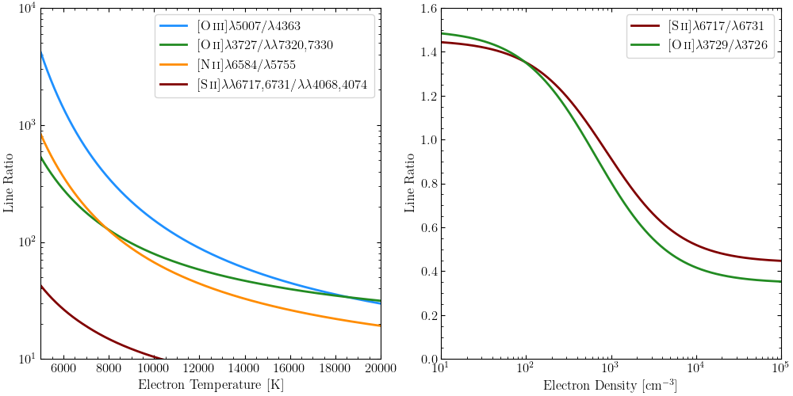

However, it's usually not as simple as measuring these line fluxes and dividing them. These two quantities, density and temperature, can depend on each other. So we have to use equations and techniques that take them both into account at the same time. For instance, let's look at the [O III]&lambda;5007/&lambda;4363 line ratio. In the left plot, I've set the density to be 100 atoms/cm3, while in the right plot, I've set the temperature to be 10,000 K. But what happens when both vary together? We get something that looks like this:

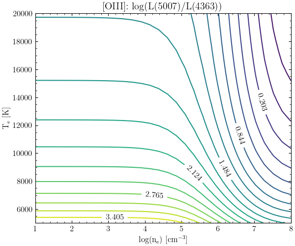

Here, we've got two varying quantities: temperature on the vertical axis and density on the horizontal axis. Each of the colored lines and associated numbers are these values for a given line ratio. So when [O III]&lambda;5007/&lambda;4363 equals 3.4, you get the yellow line, for instance. Higher flux ratios are yellower colors, while lower flux rations are more purple colors. If you just look at the values at low densities (towards the left), the lines are flat. That means there's no density-dependence, but as you go up the colors (i.e., the line ratios) change, indicating that there is a temperature-dependence. That's exactly what we saw in the previous set of plots! However, as we go towards higher densities, the lines start to curve and even start to become vertical. We lose our temperature-dependence and start to gain a very strong density-dependence. How do we know which part of this plot our nebula is in? 

Thankfully, each individual atom and their ions have their own versions of this complex plot. By detecting multiple emission lines, each with their own temperature- and density-dependence, we can narrow down on the exact temperature and density our nebula has! This is why we want tons of emission lines. 

## Measuring Emission Lines

But first, we have to measure the fluxes of these emission lines! To do that, we fit simple Gaussian functions to each of the emission lines. There are some technical details here that I'm not going to go into that are in the Notebook tutorial. I will mention one important thing: since we're trying to fit multiple weak emission lines, in order to improve the fit we want to tie their wavelengths to how much they are separated from a strong line, like H&alpha;. That's exactly what I do in the Notebook tutorial. This drastically improves the fit and gives us very accurate fluxes. As an example, below is a fit to a strong set of lines, H&alpha;+[N II]&lambda;&lambda;6548,6584, and a weaker set of lines, H&gamma;+[O III]&lambda;4363. 

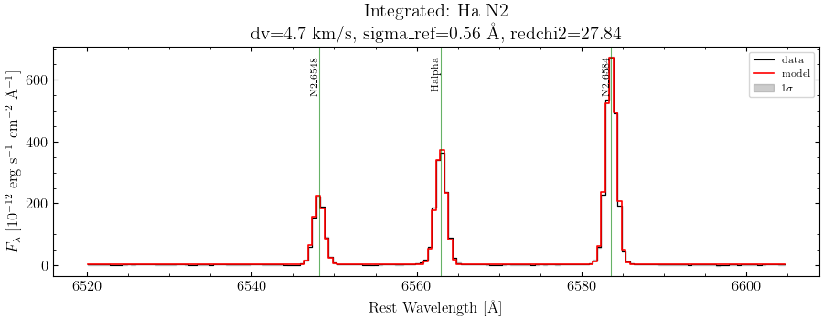
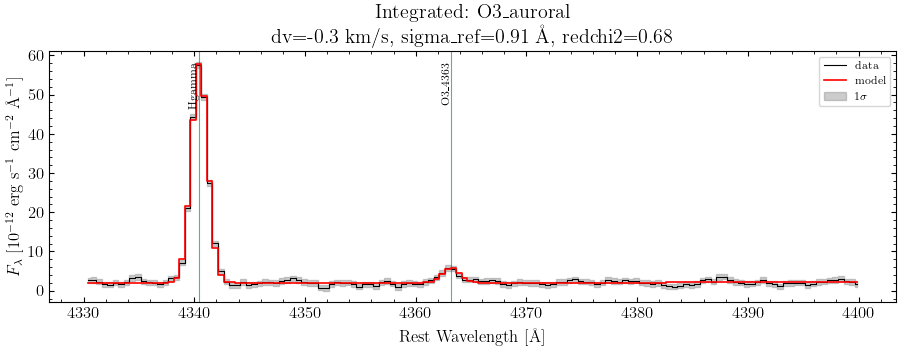

One final thing we have to do is correct our measured line fluxes for interstellar extinction. Space is full of dust. And that dust has two annoying effects: reddening and extinction. First, it generally dims light, and the light that it dims the most is blue light. You're probably familiar with this if you've ever had the unfortunate experience of being near a wildfire and looked up at the Sun. Through the smoke, the Sun will appear dimmer and redder than it normally is. Thankfully, lots of very smart people have studied the extinction effects of dust in space and it is relatively simple nowadays to correct for this. 

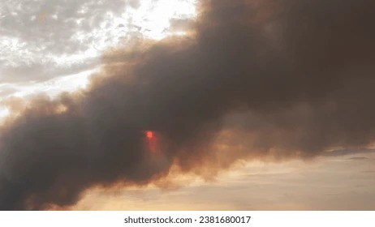

The most basic way to correct for dust is to look at the ratio of the hydrogen emission lines, usually H&alpha;/H&beta;. Quantum mechanics says that the ratio of these two lines should be equal to 2.86. This ratio does not have a strong dependence on temperature or density, so if our measured ratio is different from this, then it must be caused by interstellar dust. It turns out our measured value is about 2.94, so there does exist some dust but not a lot. We'll calculate the amount of extinction happening and correct every line for it. 

## Estimating Physical Properties

Alright, *now* we can estimate some physical properties of our integrated spectrum! Our basic steps are to calculate the density first, then estimate some temperatures. Since we're working with a planetary nebula and we expect some sort of stratification of ionization, we'll need to calculate two different temperatures, one of the low-ionization ions and another for the high-ionization ions. Namely, we'll use [S II]&lambda;&lambda;6717,6731 to estimate densities, then use [O III]&lambda;&lambda;4363,5007 for the high-ionization temperature and [O II]&lambda;&lambda;&lambda;3727,7320,7330 for the low-ionization temperature. 

| Property                    | Value              |
|-----------------------------|--------------------|
| Electron Density            | 45 cm-3 |
| Low-Ionization Temperature  | 13300 K            |
| High-Ionization Temperature | 9640 K             |

Looking at this table, these are pretty standard values for ionized gas. These agree with previous measurements as well: [Henry et al. (1999)](https://scixplorer.org/abs/1999ApJ...517..782H/abstract) measure a density less than 100 cm-3, a low-ionization temperature of 10,900 K, and a high-ionization temperature of 9,300 K. Our measurements are slighly higher for the temperatures, but this could be due to different measurement techniques and assumptions. 

From those temperatures and densities, we can calculate the *ionic abundance* of each ion. This is the amount of each ion relative to hydrogen there are in the nebula. For historic reasons, we always set the amount of hydrogen equal to 1012 (or 12 if we're taking the logarithm), so every other ion will be less than this. 

This will give us the abundances for the ions we observe, but what about the ions we don't observe? For example, we observed [Ne III], but should we have observed [Ne II] or [Ne IV]? How much of these other ions should be present? Again, some really smart people have come up with equations called *ionization correction factors* or ICFs. These take our ionic abundances and correct them for the unseen ions so that we can calculate *total abundances* for each element, rather ionic abundances for each ion. Once we've picked a particular set of ICFs, we simply apply these and get back a total abundance for each element. Based on the emission lines we've detected, we'll get total abundances for helium, oxygen, nitrogen, sulfur, argon, and neon. 

| Property           | Value | Solar Value |
|--------------------|-------|-------------|
| Helium Abundance   | 11.16 | 10.93       |
| Oxygen Abundance   | 8.67  | 8.69        |
| Nitrogen Abundance | 8.45  | 7.83        |
| Sulfur Abundance   | 6.23  | 7.12        |
| Neon Abundance     | 8.38  | 7.93        |
| Argon Abundance    | 6.37  | 6.40        |

Here, I'm reporting abundances in that logarithmic form, where hydrogen is defined to have an abundance of 12; all other elements should ideally have an abundance less than 12. Looking at our table, the most abundant element is helium. That makes sense: helium is [the second-most abundant element in the universe](https://periodictable.com/Properties/A/UniverseAbundance.sp.log.html) and stars will have produced a lot of helium in their lifetimes. After that comes oxygen, which also makes sense: oxygen is the third-most abundant element in the universe. Then we get the remaining elements, nitrogen, neon, argon, and sulfur, in order of decreasing abundance. Now we disagree with the universal abundances! What could be going on? 

We have to remember that the elemental abundances here are the direct result of a star's death, and [stars are nuclear furnaces](https://www.youtube.com/watch?v=3JdWlSF195Y). They are constantly changing light elements, like hydrogen and helium, into heavier elements through nuclear fusion. This could also explain the difference we see between the abundances of the Helix Nebula and the abundances found in the Sun. The Sun is only halfway through its evolution, and depending on the initial mass of the progenitor star of the Helix, it could have been massive enough to fuse heavier elements than the Sun will be able to. Indeed, those planetary nebulae with high abundances of helium and nitrogen are usually associated with high-mass progenitor stars. Granted, there are people who spend their whole careers studying these questions, but hopefully this gives you a little insight into why the Helix might have these abundances. 

## Two-Dimensional Spectra

All of that analysis was only for the integrated spectrum! However, we have a whole spatial dimension we haven't done anything with yet. Now let's make some maps of the different emission lines and estimate physical properties across the Helix Nebula. Thankfully, we've done most of the work already, we just have to apply our techniques to every individual fiber instead of the integrated spectrum. Of course, we'll only want to plot fibers there is actual science data for, so we'll ignore fibers that are staring at the background sky instead of the nebula. 

One of our first outputs will be flux maps. These show the relative strengths of the different emission lines in each individual fiber. I've broken the images into the strong and weak lines.

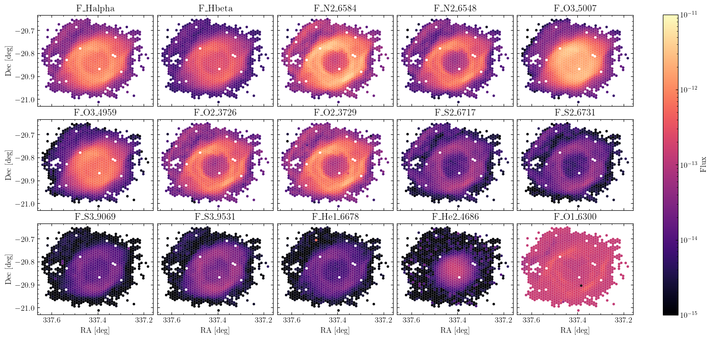
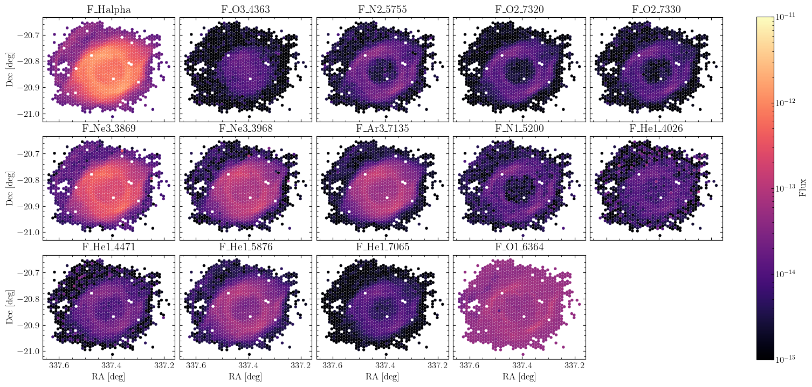

Here we see different ionization morphologies, different shapes depending on the emission line. This is that idea of ionization stratification. The hydrogen lines, H&alpha; and H&beta;, essentially show the full extent of the ionized gas. The [O III]&lambda;5007 emission line (labeled F_O3_5007 in the plot) is highly concentrated towards the center of the main ring. This is because it takes a lot of energy to doubly-ionize oxygen, so we need to be close to the central white dwarf to do that. We see similar, but fainter, concentration in some of the other doubly-ionized lines, like [S III]&lambda;&lambda;9059,9531. The helium ion He II&lambda;4686 requires much more energy to be ionized, so it is much more centrally concentrated. In contrast, emission lines like [O II]&lambda;3727, [N II]&lambda;&lambda;6548,6584, and [S II]&lambda;&lambda;6717,6731 highlight the low-ionization features, such as the faint outer "arm" that lies beyond the main ring. 

Taken together, we have this picture that near the central white dwarf are very highly ionized ions like He II. As we move further away, we lose those highly energetic photons as they're absorbed, resulting in this stratification. We go from He II, to [O III] and [S III], to [N II], [S II], and [O II], decreasing in ionization as we go. And even though they're fainter, the weaker lines show this same stratification: [O III] at the center, then [Ne III] and [Ar III], then further out ions like [O II] and [N II].

Finally, we can make maps of the physical properties. I'll focus on two maps, the density and the oxygen abundance. 

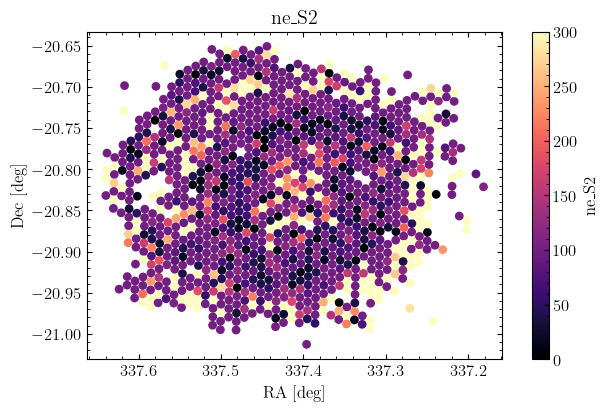
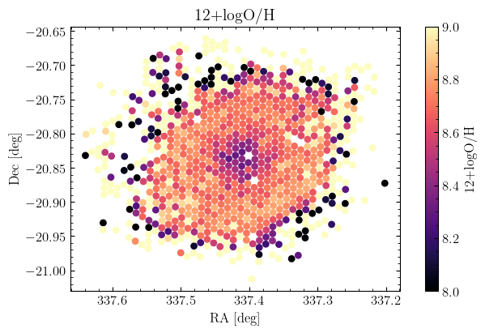

The electron density map shows essentially the same purplish color throughout, indicating that most of the nebula is at the same density, approximately 100 atoms per cm3. Again, just like in our integrated case, this is pretty standard for ionized gas. The oxygen abundance map shows more interesting behavior. It looks like near the central star, there are lower abundances which then increase as we go further out. Is this a result of the changing temperatures across the region? Is there just less oxygen towards the center? Is it a mixture of both? I don't really know. Just like before, there are many people who spend a lot of time thinking about these questions. I'll point interested readers to the latter sections of [Peimbert et al. (2017)](https://scixplorer.org/abs/2017PASP..129h2001P/abstract) for a good discussion. 

## The End

Well, that's the end of this little project! I've learned a lot about planetary nebulae and direct-method measurements of elemental abundances. As part of this project, I've written a tutorial Notebook in case anyone wants to see what I've done. I did a lot more than what I've talked about here in this blog post. I've put that Notebook as well as a bunch more plots on my GitHub, which you can access using the link at the top of the page. As far as I know, the LVM team has only released one paper on the Helix Nebula as a proof of concept. Hopefully a future paper will be written doing a more in-depth and careful analysis of its abundances than I have done here. I'll keep an eye out for it, and I'll update this post with more info and comparisons. Hope you've enjoyed this detour into planetary nebulae abundances as much as I have! 