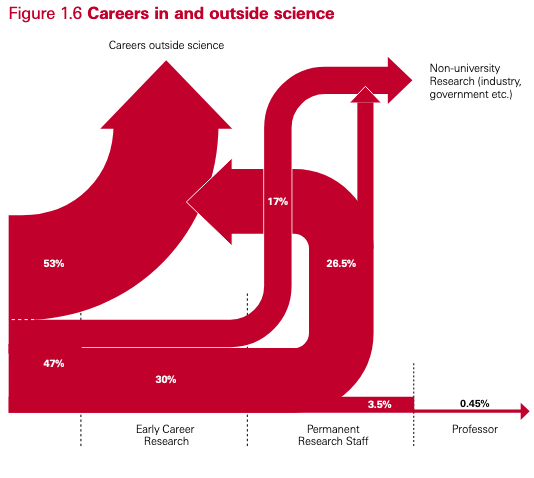

I hope that everyone is aware of how broken academia is. Graduate students are often the ones who are most aware of how academia is broken. We’re paid less but expected to do more, we typically have worse health insurance than our professors, we face harassment and discrimination often without recourse to resolve those issues, just to name a few. 

This creates a culture that often diminishes a student’s will to remain in academia. [One study stated](https://pubmed.ncbi.nlm.nih.gov/28922403/) that although 80% of science students start their PhD with the intention to pursue a career in science, by the time of their graduation, only 55% plan to continue in academia. And even for those 55%, not all of them will achieve the dream they were told they could reach; [for every 200 people who complete a PhD](https://royalsociety.org/~/media/royal_society_content/policy/publications/2010/4294970126.pdf), only seven will get a permanent academic job and only one will become a professor. 

|  |
|:--:|
| Figure 1.6 in [_The Scientific Century: Securing Our Future Prosperity_](https://royalsociety.org/~/media/royal_society_content/policy/publications/2010/4294970126.pdf) |
    

It is this version of academia that graduate students see and have to live in. And for the past three years, I have been trying to fix it and make the lives of graduate students here at Case Western marginally better. However recently, that betterment seems to be becoming more marginal and marginal. 

For three years now, I have been an officer of the Graduate Council of Arts & Sciences (GCAS), the governing body for all graduate and professional students in Case Western’s College of Arts & Sciences (CAS). I joined GCAS in the winter of 2020 as its treasurer, right before the onset of the COVID-19 pandemic, eager to meet new students and help them navigate graduate student life. 

When the pandemic hit and everything moved virtually to Zoom, we still thrived because everyone wanted to maintain some social connections. Just like everyone else, we were limited in what we could do (no in-person Friendsgiving dinner, but we’ll email you a gift card to local eatery), but that didn’t really slow our roll immediately. We had a few small issues contacting some departments, but otherwise GCAS was operating well given the circumstances. 

At the end of Spring 2021, I was elected Co-President alongside my friend Cameron from the Chemistry Department. As pandemic restrictions lifted (for better or worse), we transitioned back to in-person meetings and in-person events. But suddenly, no one was showing up to our meetings except the officers, and no one was showing up to the few events we had planned. What was the cause of this? 

Originally, I’m sorry to admit, I blamed it on my fellow students. For some reason, they didn’t seem to care anymore. I got fed up with it. Here I was, giving up some of my time to help graduate students who couldn’t even be bothered to show up to meetings. I was ready to be done with it. But when Spring 2022 came around, and no one really wanted to take the role of President, Cameron and I (after some pleading from our liaison in the CAS administration) agreed to stay on as Co-Presidents for another year. 

This time, Cameron and I knew that we couldn’t do all the work for GCAS like we had been doing. We were both planning on graduating come the end of the academic year. We have very involved officers who share our commitment to doing better by our graduate students. Suddenly we had committees looking at how graduate students are being paid across CAS, where the payment discrepancies are, which departments are getting more money than others, etc. We have a committee organizing a revamped professional development week with input from alumni who are successful in their fields! Everything seemed to be going great! 

One thing that was still suffering however was our communication. There are 21 departments in CAS and we had representatives from maybe 5 of them (not counting officers representing their own departments) and not all of them came to our meetings. I made it my personal goal this semester to have individual meetings with every department: the ones we have representatives for, the ones we know exist, and the ones we didn’t know if they existed. I wanted to impress on them the importance of GCAS and ask how we can help them. 

And that’s when I realized that my blaming the students for not showing up to meetings was very wrong. They’re not showing up because they are burnt out and not receiving enough support. They’re not showing up because there’s not enough of them. They’re not showing up because they don’t know how they can fix any of this. 

After being shocked at how many departments have single digit populations of graduate students (the Modern Languages department has _zero_ graduate students, Cognitive Science, Classics, and Religious Studies all have one student, Astronomy has two students, etc.), I was reminded that despite all of our vastly different disciplines, we’re all facing very similar issues. Despite a minimum 5% pay increase we got last academic year[^1], we’re all still struggling with making ends meet. Our health insurance leaves much to be desired and often leaves us with very large medical bills. With the overturning of _Roe v. Wade_, while Case Western has launched a [Reproductive Health Task Force](https://case.edu/reproductivehealth/), the resolutions it has passed has mostly helped the undergraduate students, leaving the graduate students to figure it out on their own. 

[^1]: I tried to find a reference to this on CAS's website, but alas, I couldn't find anything besides an email in my inbox from the Dean herself. That should tell you something.

Furthermore, our departments are in crisis. There is a long-standing history (and a recent history) of CAS not getting as many funds as, say, the School of Medicine, School of Law, School of Engineering, etc., get. This severely limits the sizes of our departments, and the hiring freeze put on us as a consequence of the pandemic hasn’t helped the situation. As a result, we don’t have enough professors to mentor graduate students, let alone teach undergraduate classes. That means the graduate students who remain are being asked to pick up more and more work alongside their normal responsibilities. 

I try. I try really hard to fix these issues. Some of them, like health insurance, are mostly out of my hands. I can really only make the administration aware of the issue and poke them occasionally to remind them. Others, like our salaries, I can collect numbers and data on and show the administration who is being shafted and who needs more money. But most of the time, all I feel like I’m doing is talking. That’s not bad in and of itself, but it pales in comparison to action. 

Recently, after dealing with a particularly angering issue, Cameron joked with me and asked, “So, when are elections?” I laughed and honestly couldn’t agree more. I hate it that I’ve become the stereotypical, grizzled fifth-year student, but that’s what’s happened. I’m going to keep trying while I’m here at Case Western, and I’ll continue to fight for graduate students (and postdocs too!) even when I’m not one at whatever institution hires me. But I have to admit that some of the light has gone out of my tired eyes. 

Maybe it’s time for a new person to take up the fight here at Case Western. I wish them all the luck in the world.  
