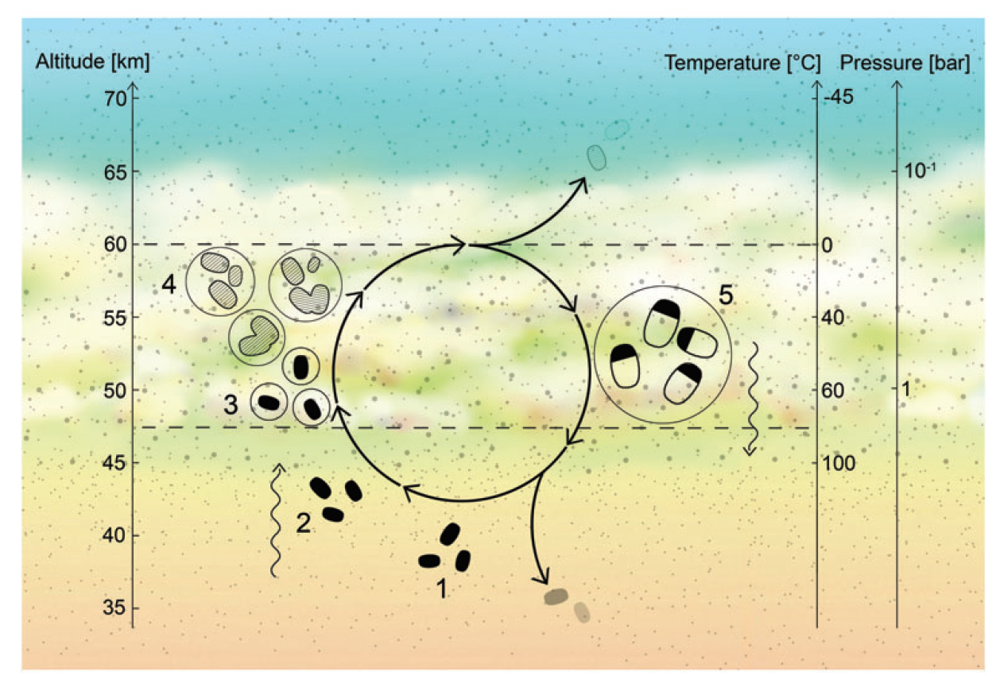

This year, [a paper came out](https://ui.adsabs.harvard.edu/abs/2020NatAs.tmp..178G/abstract) about the detection of phosphine in the cloud decks of Venus. Immediately, science news writers were screaming, “LIFE DETECTED ON VENUS!!!!” I promise you, that was not the case, but it is definitely interesting in and of itself and might point towards more observations required for us to definitively say that we’ve detected life on Venus. Let’s talk about that.

## A Refresher on Venus

First, let’s bring everyone up to speed about Venus. Venus, named after the Roman goddess of beauty and nicknamed "Earth’s twin," is the second planet from the Sun. It resides at an average distance of 0.72 AU (an AU, or astronomical unit, is the average distance between the Earth and the Sun, about 93,000,000 miles) and completes an orbit every ~225 days. It has the most circular orbit of all the planets.

However, that’s probably the most normal thing about it. Most planets orbit the Sun in a counterclockwise direction if you are looking at them from above the Earth’s North Pole. And Venus does that! Furthermore, most planets also rotate on their axis in the same counterclockwise direction. There are two major exceptions to that rule: Uranus, which is tilted more than 90 degrees on its side, so it looks like it tumbles around the Sun, and, you guessed it, Venus. Long ago during the formation of the Solar System, scientists think that Venus was smacked by a large body, causing Venus to flip over entirely. Since then, Venus has rotated clockwise, opposite to its orbit direction. What’s more is that it rotates so slow (~243 days) that its day is longer than its year!

The surface of Venus is also very weird. It is obscured by constant cloud cover, so the only information we have about the surface came from the few minutes artificial landers have survived and radar imaging from orbit. Most of Venus is covered in "deposition plains," giant flat plains of lava rock. This is broken up here and there by a few craters. However, when you compare the number and age of the craters on Venus to other places in the Solar System, like the Moon or Mars, Venus has very few craters. It looks like the thick atmosphere burns up all the small meteorites before they reach the ground, but what about the large meteorites?

Scientists were confused about that too, but they came up with a theory. They hypothesize that Venus goes through periodic "global resurfacing events." In this event, pressure from magma and trapped gases builds up underneath the surface. This happens on Earth too, but the Earth has cracks in its crust in the form of fault lines between tectonic plates for the pressure to escape through. But Venus has no tectonic activity, so no fault lines to let out that pressure. The pressure builds up, builds up, builds up until the surface can’t hold back anymore and the entire surface explodes, covering itself in lava. This erases the presence of any old craters, making the surface look young again.

As if that wasn’t enough, let’s look at the atmosphere now. The thick atmosphere of Venus is primarily carbon dioxide with some nitrogen and other trace gases. Those trace gases include fun compounds like hydrochloric acid, hydrofluoric acid, carbon monoxide, sulfuric acid, hydrogen sulfide, phosphorous acid, and phosphoric acid. Fun stuff!

Near the surface, the weight of all that atmosphere above it makes the surface pressure equivalent to 92 times that the Earth’s surface! To experience that on Earth, you’d have to be 5.5 miles deep in the ocean.

Adding to the crushing pressures is the excruciatingly hot temperatures. Thanks to all that carbon dioxide and sulfur dioxide in the atmosphere, Venus has a runaway greenhouse effect. This raises the temperature at the surface to a scorching 873&deg;F! This makes it hotter than Mercury, the closest planet to the Sun. If you were on Venus and held a frozen pizza outside in your hand, it would cook in three minutes. Admittedly, it would also melt from the raining sulfuric acid, but it’d be cooked! 

## The Detection

And yet, among all that hell, there exists a part of its atmosphere that is just right. This Goldilocks zone is 30-37 miles above the surface at a balmy temperature of 140&deg;F and a pressure of about 1 Earth atmosphere. A little too hot for humans, but there are plenty of microbes on Earth that can survive that sort of temperature and pressure. 

<figure>

<figcaption>A schematic of Venus' atmosphere. Note the temperate zone at an altitude of 48-60 km (30-37 miles), temperature of ~60&deg;C (140&deg;F), and pressure of ~1 bar (1 Earth atmosphere). Fig 1 of <a href=https://ui.adsabs.harvard.edu/abs/2020arXiv200906499B/abstract>Bains et al. (2020)</a></figcaption>
</figure>

This is where we join the story of the detection of phosphine on Venus. Jane S. Greaves (Cardiff University) and her collaborators had the goal of using Venus as a benchmark for other studies. They hadn’t set out to specifically detect phosphine, yet, when they looked at it through their telescopes, they found something!

They originally used the [James Clerk Maxwell Telescope (JCMT)](https://en.wikipedia.org/wiki/James_Clerk_Maxwell_Telescope), a submillimeter telescope, to probe the atmosphere of Venus. When you hear the word "telescope" here, don’t think of a tube used by Galileo or Hubble or pirates. Think more along the lines of a giant radio dish. This Hawai'i-based telescope has been designed to see light in the infrared, specifically light with a wavelength between a few 100 micrometers to a millimeter.

When they analyzed the data they got from the JCMT, they found the signature of phosphine in their data! However, their signal was weak and they needed to confirm that it was actually phosphine and not some random noise or some other molecule pretending to be what its not.

They used their initial detection to get some time on the [Atacama Large Millimeter/submillimeter Array (ALMA)](https://en.wikipedia.org/wiki/Atacama_Large_Millimeter_Array), a much better telescope for the job. Once again, this is not a telescope in the traditional sense, but actually 50 40ft radio dishes high up in the Atacama Desert in Chile.

When they peered through the 50 eyes of ALMA, they got an even stronger detection of phosphine! This was no coincidence! Furthermore, it was detected right in the temperate zone of Venus’ atmosphere, about 33-38 miles up!

Now, what is this phosphine? Phosphine is a molecule, a single phosphorus atom that has three hydrogen atoms attached to it. It is an odorless, colorless, and, like everything else on Venus, highly toxic gas. It easily burns with oxygen to produce phosphoric acid, highly corrosive in large quantities, but safe enough in small quantities to find it in your toothpaste and soaps.

We have found phosphine in three places in the Solar System: Jupiter, Saturn, and Earth. On Jupiter and Saturn, the chemical compositions, as well as the temperatures and pressures, are just right that phosphine is naturally produced in abundance. It is energetically favored to be produced. Meanwhile, on Earth, we know of only two things that produce phosphine: microbes and human industrial activity. For that reason, it has often been listed as a biosignature, a chemical that is a good indicator for the presence of life on other planets. 

## Ruling Out the Implausible

It was now up to the authors of this paper to show whether or not this phosphine could be produced naturally on Venus or required the presence of life to be produced. Abundance modelling showed that phosphine was present in 20 parts per billion (ppb) amounts. Now, what can produce that amount?

The authors of this paper were very thorough. They looked at every possible angle. Could energy of the Sun produce phosphine in the upper layers of the atmosphere? Nope, it would be destroyed too fast by that same solar energy. Maybe under certain conditions (temperatures, pressures, concentrations, etc.) phosphine could be spontaneously created? Turns out, its chemically unfavorable to do so; Venus would much rather form phosphoric acid and the like.

The researchers looked at even more absurd ideas. Was phosphine delivered to Venus by meteorites? Nope, Venus is accreting the right type of meteorite about 100 million times too slow. It requires energy to make phosphine, right? What if Venusian lightning delivered that energy! It would take a solid year of lightning, with no destruction, to create measurable abundances, and even then, its 10 million times too low. They looked at more things like giant meteor impacts (nope), Venus-quakes (how?), volcanic eruptions (not happening), and on and on.

Eventually, they came to the conclusion that either there is some sort of unknown chemistry happening on Venus or life is producing phosphine in measurable amounts.

I personally want to stress that this does not mean that the scientists who wrote these papers and did the observations are saying they found proof of life existing in the clouds of Venus. They are very adamant that more research needs to be done. There is still plenty of information we are missing about the Venusian environment; [the last lander](https://en.wikipedia.org/wiki/Vega_2) to plummet through the clouds and touch the surface of this alien world was in 1985. We also don’t know enough about phosphine and how it reacts biologically. More chemical research needs to be done as well. 

## But, what if there was?

All that being said, let’s play the imaginative game and pretend there’s life on Venus. How could it survive?

There are a few things we know it would have to do. First, it would have to survive in liquid droplets in the clouds; it could not survive just free-floating in the air. A free-floating cell would lose water until it matches the outside environment and on Venus, that environment is 10 times drier than the driest place on Earth. Bad news for a cell that needs water to survive!

These cells would also have to evolve some way of dealing with all the sulfuric acid in the clouds. Some researchers have seen how extremophiles here on Earth can survive in very acidic, high temperature, low water environments and said, "Yeah, that could happen on Venus too!" I cannot stress this enough that that assumption is incorrect.

The [Dallol Geothermal Area in Ethiopia](https://en.wikipedia.org/wiki/Dallol_(hydrothermal_system)) has acidic pools of water at 225&deg;F, that is hypersaline, containing hydrothermal vents as well as the lowest pH ever recorded: -1.7. The pH scale normally only goes down to zero; its not meant to go down to negative numbers. Here on Earth, this highly acidic environment has sulfuric acid dissolved in water. On Venus, the clouds are water dissolved in sulfuric acid, making it 100 billion times more acidic than the most acidic place on Earth. Life would have to find a way to survive that.

The Venusian atmosphere is also extremely arid. The most arid place on Earth is Death Valley. On average, it has a humidity of about 2%. The Venusian atmosphere is equivalent to a humidity of ~0.07% at room temperature. This makes it extremely hard for cells to hold onto water.

Microbes exist in the Earth’s atmosphere too. But they don’t live up there. They can rely on the fact that at some point, they will fall back to the ground to gain nutrients and reproduce. The surface of Venus is uninhabitable, even by microbes. They have to spend their entire life cycles up in the air, making gaining nutrients very hard.

Gaining energy will be very hard too, but thankfully light is in abundance in the atmosphere. Most likely, Venusian life will have to be photosynthetic. 

<figure>

<figcaption>A proposed life cycle for Venusian life. (1) Dessicated spores persist in the lower atmosphere. (2) An updraft of spores transports them to the habitable layer. (3) Spores accumulate a liquid environment and become active. (4) Active microbes grow and reproduce. (5) Droplets rain out, while the microbes transform into spores again, resting in the lower atmosphere. Fig 1 of <a href=https://www.liebertpub.com/doi/pdf/10.1089/ast.2020.2244>Seager et al. (2021)</a></figcaption>
</figure>

All that said, there is still the possibility of life on Venus. If Venusian life exists as a microbe that is able to reproduce in the clouds, and survive the extreme environment, then life is likely. One such suggestion by researchers is that life will take the form of a bacteria-like species that reproduces in the clouds, and, upon dropping to lower layers, transforms into spores that can survive down there until an updraft of wind brings them back into the temperate zone. But that’s just a theory. 

## Only Time Will Tell

Does life exist on Venus? Right now, we’re uncertain. We’ve certainly found an interesting detection in this phosphine measurement, but we really won’t know until NASA or some other space agency (I’m looking at you, Russians) sends a new mission there. This is an exciting time to be studying the planets of our solar system, so be sure to keep an eye out for more news from our sister planet!

<figure>

<iframe width="560" height="315" src="https://www.youtube.com/embed/dfD0rfK6zuY" title="YouTube video player" frameborder="0", allow="acceleromter; autoplay; clipboard-write; encrypted-mdeia; gyroscope; picture-in-picture" allowfullscreen></iframe>

<figcaption>This is a recording of the "Public Astronomy Talks with Ray" that I led about the discussion of life on Venus and the results from this paper on September 20, 2020.</figcaption>
</figure>

<em>I was also interviewed by the Case Western </em>Observer<em> about this topic. If you'd like to read that article, click <a href="https://observer.case.edu/mapping-the-secrets-of-life-within-our-sister-planet/">here</a>.</em>