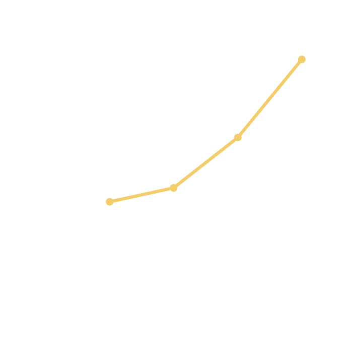
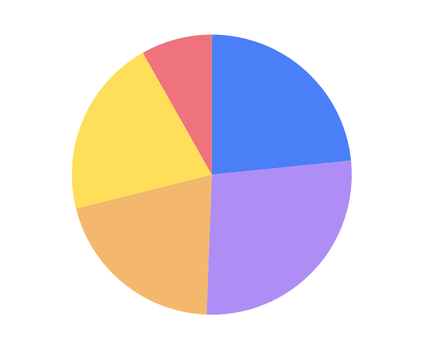
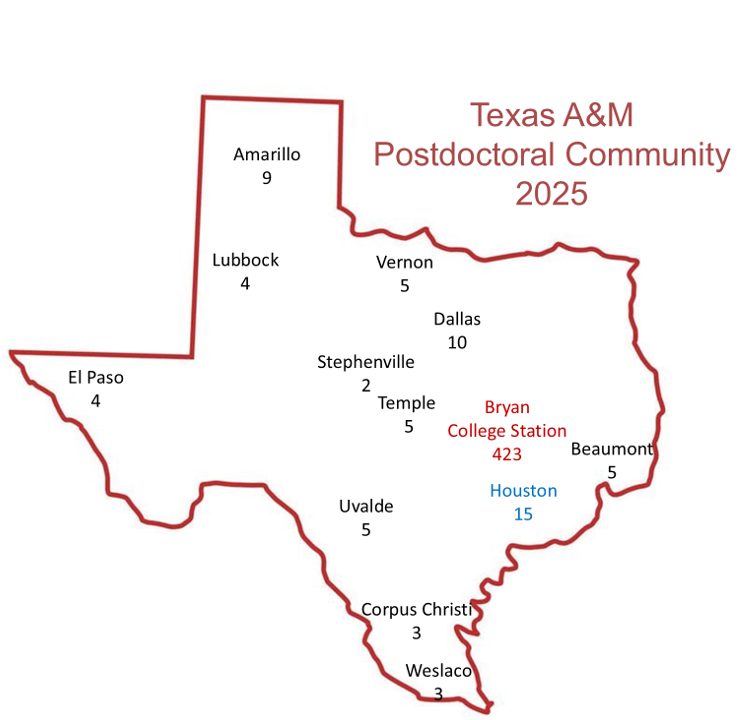
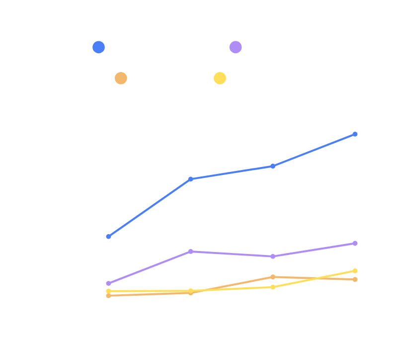
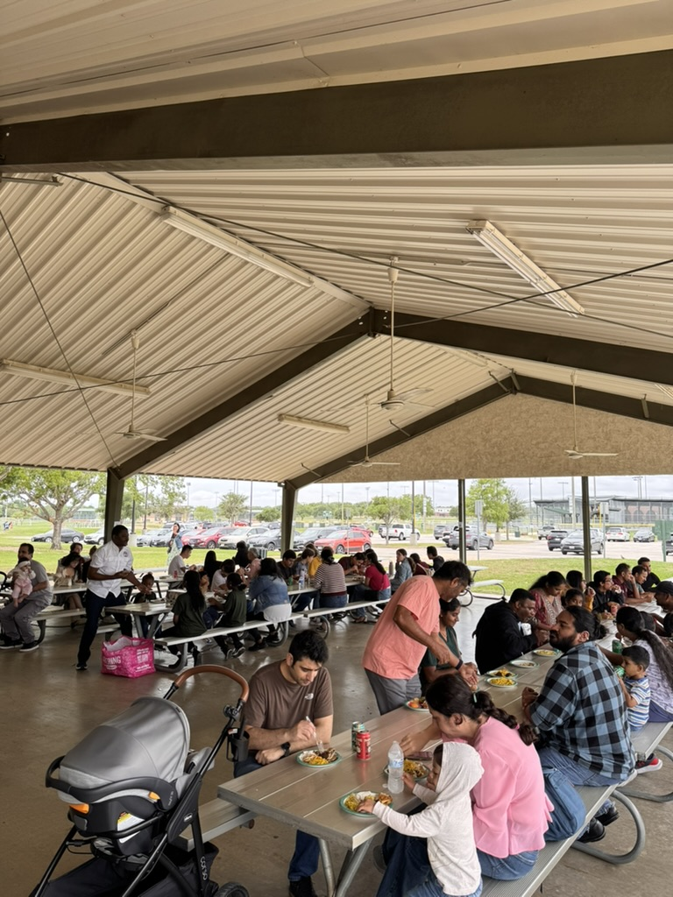
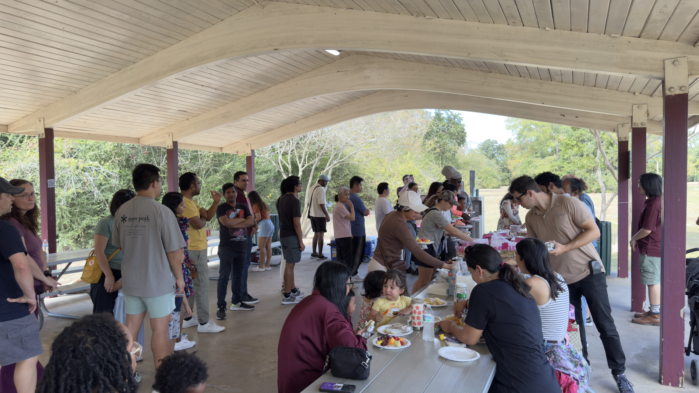
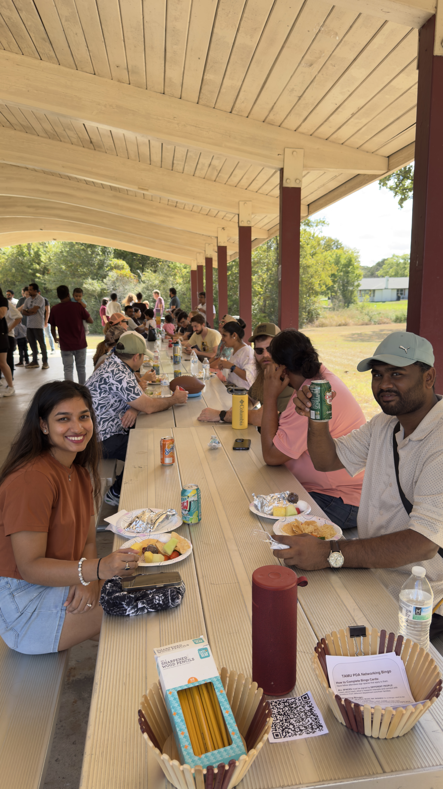
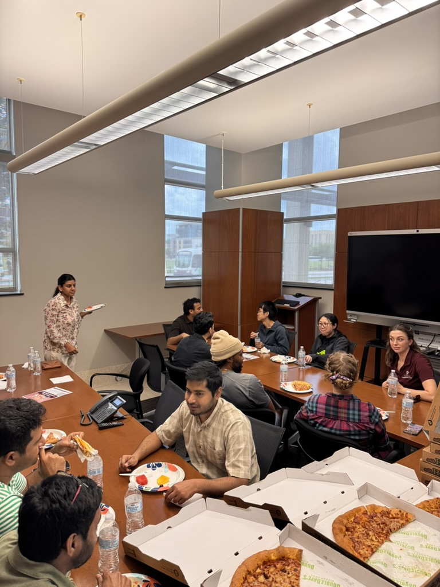
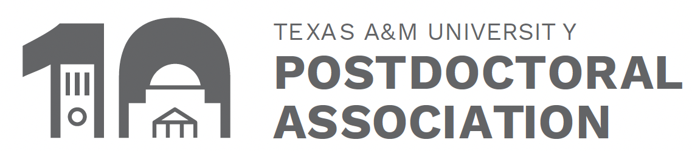
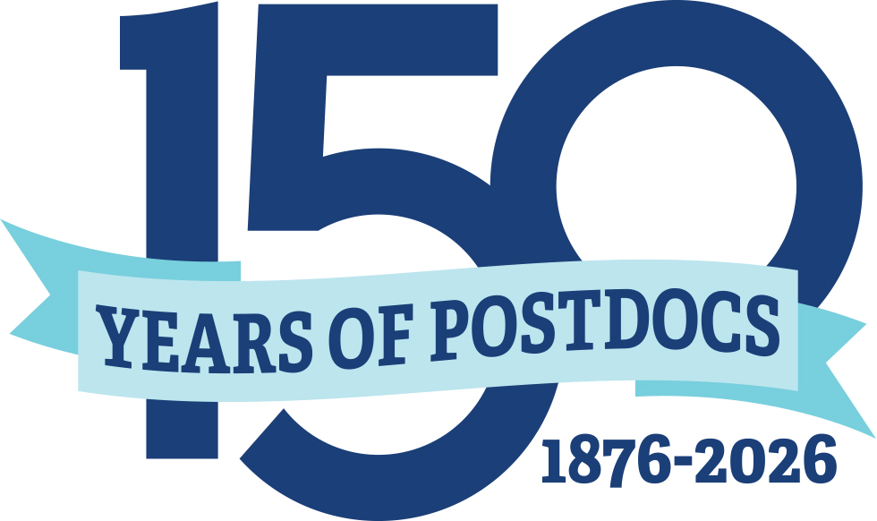

Good afternoon, everyone, and thank you for being here. My name is Ray Garner, and I am a postdoc in the Department of Physics & Astronomy in the College of Arts & Sciences and the President and Communications Officer of the Texas A&M University Postdoctoral Association. 

Our annual General Assembly is, in many ways, our version of a State of the Union. It is a chance to reflect on where we are as a postdoctoral community, to celebrate what we have accomplished together over the past year, and to speak honestly about both the opportunities and challenges that lie ahead.

And if there is one word I hope defines this year, it is resilience.

This has not been an easy year. And yet, this community has endured. More than that, it has continued to grow, to contribute, and to show up for one another. That is resilience. Not pretending things are easy, but continuing forward together even when they are not.

So, if I may borrow the language of the actual State of the Union, I am proud to say this: the state of the postdoctoral community at Texas A&M is strong. Strong not because we have been spared challenges, but because we have met them with resilience, commitment, and community.

## Community Growth

In fact, our community has grown. There are currently 674 postdocs at Texas A&M University, representing a 15% increase from last year. That is a remarkable number, and it speaks to both the scale and importance of the postdoctoral community here. Our postdocs are distributed approximately equally across four major sectors of the university: the College of Engineering, the College of Agriculture and Life Sciences, the College of Arts and Sciences, and the combined communities of Texas A&M Health and the School of Veterinary Medicine and Biomedical Sciences, and in smaller amounts in several other Colleges.

<head>
    
</head>

  

    
  

  

    
  

And while many of us are here in Bryan/College Station, our postdoctoral community extends far beyond this campus. We are spread across 13 additional satellite campuses, from nearby Houston all the way to El Paso and Amarillo. That geographic reach is important. It reminds us that the PDA is not simply an organization for one building, one department, or even one campus. It is an organization for postdocs across Texas A&M University, wherever they may be.

That growth and breadth make our mission even more important: to build community, create visibility, advocate for postdocs, and make sure that no one in this career stage feels invisible or unsupported.

Over the past year, I believe we have made real progress on that mission.

One of the clearest examples was our 9th Annual Postdoctoral Research Symposium, which was the most highly attended symposium we have ever had. We welcomed 235 attendees, an increase of 43% over last year. We had 62 postdoc presenters and recognized 6 awardees, showcasing the talent, creativity, and scholarly excellence of postdocs across the university.

  

    

      
      <figcaption>Postdocs presenting their research.</figcaption>
    

    

      
      <figcaption>The awardees of the Faculty Excellence in Postdoc Mentoring Awards.</figcaption>
    

  

  

      

        
        <figcaption> Dr. George Ligler delivering his keynote address.</figcaption>
      

      

        
        <figcaption>The volunteers that made the Symposium happen.</figcaption>
    

  

Those numbers matter. They do not just represent attendance. They represent visibility. They represent engagement. They represent a community that is resilient enough, even in a difficult year, to come together and celebrate outstanding scholarship.

This year’s symposium also marked an important new step for us. For the first time, we recognized five faculty members with our Faculty Excellence in Postdoc Mentoring Awards. I am especially proud of that addition. Good mentoring can shape the entire trajectory of a postdoc’s experience. It can be the difference between merely getting through a position and truly growing in it. By recognizing excellent mentors, we are also reinforcing the kind of culture we want to build here: one that values not only research excellence, but also thoughtful guidance, professional development, and genuine support for early-career scholars.

We were also fortunate to hear an excellent keynote address from [Dr. George Ligler](https://engineering.tamu.edu/mtde/profiles/ligler-george.html), Professor of Multidisciplinary Engineering, who reminded us of something many postdocs know deeply: that it is okay to be interdisciplinary, and more than that, that building the ability to work across boundaries is a skill we will need. That message resonated with me, and I suspect it resonated with many of you as well. Many postdocs already live in those in-between spaces, between disciplines, between methods, and between traditional academic categories. Learning to thrive there is part of the resilience this career stage demands.

Of course, the symposium was only one part of a much larger year.

Over the last year, the PDA, often in collaboration with the Office of Postdoctoral Affairs, helped host 32 events with a total attendance of 1,657 people, an increase of 24%. That number reflects not only the work of the PDA, but the strength of our partnership with the Office of Postdoctoral Affairs and our shared commitment to creating meaningful opportunities for postdocs across campus.

Our highest attendance came from career development workshops, especially programming focused on Individual Development Plans, or IDPs. That tells me something important: postdocs want space not only to do their current work, but to think intentionally about their futures. They want guidance. They want professional development. They want tools to help them navigate a career stage that is often exciting, but also uncertain.

We also continued another round of the Postdoctoral Mentoring Academy, in collaboration with the Center for Teaching Excellence and the Office of Postdoctoral Affairs. I want to note here that I participated in the academy myself, and I found it genuinely valuable. I learned new approaches to mentoring, and I was introduced to practical resources like the mentor-mentee compact, which has already improved how I think about working with students and setting expectations in mentoring relationships. It helped me become more intentional, more communicative, and, I hope, a better mentor. I imagine many others who participated found the same. Programs like that matter because they help us grow not only as researchers, but as leaders, teachers, and mentors.

## Social Events

But it has not all been work, and I am glad of that.

Resilience does not come only from pushing harder. It also comes from connection, rest, and community. It comes from knowing the people around you. It comes from feeling that you belong somewhere.

We continued to host our semesterly Spring and Fall Picnics, and I want to give a huge shoutout to our Event Coordinator, Dr. Delaney Clouse, for organizing those, including arranging the food and reserving the park. Those events may seem simple on paper, but they matter enormously. They create space for postdocs and their families to gather, relax, and build the kinds of relationships that make a large university feel smaller and more human.

  

    
  

  

    
  

  

    
  

  

    
  

This year we also piloted Meet & Greet events, informal lunchtime gatherings where postdocs can not only meet members of the Executive Committee, but also step away from the lab, office, or classroom and meet other postdocs they may not otherwise encounter. We hosted several of these, including two specifically for Engineering and Arts and Sciences, and we intend to continue them. Sometimes resilience begins in small ways: a conversation over lunch, a new connection, the realization that someone else understands exactly what you are navigating.

## Social Media

We have also continued to strengthen our visibility through social media. Across Instagram, Facebook, and LinkedIn, our total number of followers has increased significantly on each platform. But more important than the growth itself is what we have chosen to do with those platforms.

Last year, we expanded our Executive Committee Spotlight into a broader effort to recognize postdocs more widely. What began as the Satellite Campus Spotlight Series, highlighting postdocs who are often overlooked at our satellite campuses, evolved into our Where Are They Now? series, where we feature former postdocs and the ways they used both their research experience and their professional development to build successful careers.

I care deeply about these spotlight series because they do more than fill a social media calendar. They tell stories. They give visibility to postdocs who might otherwise go unseen. They remind current postdocs that their work matters and that there are many possible futures ahead of them. We absolutely plan to continue recognizing the amazing work postdocs do across this university in new forms going forward.

## Advocacy

Of course, visibility is only one part of what the PDA does. Another major part is advocacy.

We are making sure that postdocs have a seat at the table on campus. The PDA serves on several administrative bodies as the postdoc voice, including the University Staff Council, the Council of Principal Investigators, and the Center for Teaching Excellence Faculty and Student Advisory Board. We are regular voices in those spaces, making sure that the needs, concerns, and perspectives of postdocs are not forgotten.

We also have biannual meetings with the Associate Vice President for Research, [Dr. Gerianne Alexander](https://artsci.tamu.edu/psychological-brain-sciences/contact/profiles/gerianne-alexander.html), who has consistently been willing to listen to our concerns. That matters. Advocacy is not always loud. Sometimes it is steady, persistent, relationship-based work: showing up, speaking clearly, raising issues early, and making sure postdocs remain visible in institutional conversations. Resilience is easier to sustain when people know they are heard, and advocacy is one of the ways we help make that possible.

Our engagement beyond campus is also going strong.

Texas A&M remains an institutional member of the [National Postdoctoral Association](https://www.nationalpostdoc.org/default.aspx), which means that our postdocs, faculty, staff, and students can become affiliate members and gain access to a wide range of NPA resources, including the Career Center and their monthly Smart Skills workshops. About 150 postdocs have already taken advantage of that opportunity, and I would encourage even more to do so.

And the NPA knows who we are, too.

We were honored in the [November 2025 issue of The POSTDOCket](https://www.nationalpostdoc.org/page/POSTDOCketLibrary_25#1025_2), which highlighted the work we did as part of National Postdoctoral Appreciation Week. One of our own Executive Committee members, Dr. Dylan Pham, has been serving as the Chair of the Social and Networking Subcommittee of the NPA Meetings Committee. And I had the privilege of attending the NPA Annual Conference in San Francisco this past March, where I was delighted to learn that a Texas A&M alum, [Dr. Sunny Narayanan](https://rider.eng.famu.fsu.edu/person/sunny-narayanan), now Research Faculty at Florida State University, served as the organizing chair of the event.

One of the biggest things I took away from that conference, after speaking with postdoc leaders from around the country, was this: we are doing really well here.

Truly. 

While many universities are still trying to figure out how best to support their postdocs, I came away feeling confident that Texas A&M is ahead in many important ways. We have experience. We have leadership. We have strong partnerships. We have meaningful programming. And perhaps most importantly, we have engagement from you. The numbers support that feeling, yes, but so does the culture we are continuing to build.

## Challenges Ahead

That said, resilience does not mean pretending everything is fine.

There is still much work to do.

For all of our record-breaking attendance and growing engagement, we are still only reaching about half of the postdocs on campus. That is not a failure, but it is a challenge, and one we take seriously. I know that postdocs are busy by nature. You are busy doing research, mentoring students, writing papers, teaching courses, applying for jobs, building your lives, and in many cases raising families. It is not always easy to step away and attend one more workshop, one more social event, one more meeting.

But we want every postdoc to know that these resources exist for them.

That is why, every two weeks, we receive an updated list from HR of all postdocs on campus, and new postdocs receive a welcome email with a collection of resources, including our [FAQ booklet](https://tamucs.sharepoint.com/:b:/t/Team-research.tamu.edu/IQC8BcWUeYfxRY0pFogIynm1AadmDrz5dYqZT8EBA0rv76Y), a [Postdoctoral Handbook](https://research.tamu.edu/wp-content/uploads/2024/12/PostDocHandBook.pdf), and a [calendar of upcoming events](https://calendar.tamu.edu/postdoctoral-association/all). We also hold both spring and fall New Postdoc Orientations, where offices from around campus introduce postdocs to the many resources available to them.

And I would encourage postdocs to attend one even if they are not brand new to campus. In my role on the Executive Committee, I have attended these four or five times, and while I would not necessarily recommend doing that, I can say that attending even once is incredibly valuable. It is a chance to learn not only what resources the university offers, but also how those resources can strengthen your research, your professional development, and your overall experience here. Reaching every postdoc will continue to be one of our priorities, because support only matters if people know it exists.

And of course, some of the biggest challenges facing postdocs are not local at all. They are national, and in some cases global.

Postdocs continue to face growing pressures from federal funding cuts, which are already affecting people in tangible ways. The job market is difficult. I say that not only as an observer, but personally: I am on the job market right now, so I know very well how heavy that uncertainty can feel.

I wish I could stand here and say that we could fix all of this instantly. I cannot. I do not have a magic wand, and neither does the PDA.

But what we can do is continue to support one another. We can continue raising concerns to university leadership. We can continue building relationships with administrators who understand these challenges. And we can continue listening. Resilience is not an individual burden; it is something communities build together.

## Community Input

We need to hear from you. 

We need to know what issues you are facing, whether they are large-scale structural concerns or smaller day-to-day obstacles. Sometimes the biggest problems are national. Sometimes they are surprisingly local. Either way, our ability to advocate depends on knowing what this community is experiencing. You can always reach us at our email pda at tamu.edu or you can reach out to the Office of Postdoctoral Affairs at opa at tamu.edu. We are here to help, to listen, and to advocate for you.

I also want to take a moment to note that we are still accepting applications for several open positions on the Executive Committee: Vice President, Event Coordinator, Treasurer, Communications Officer, and Satellite Campus Officer. There are three days remaining until the application deadline, so if you have been inspired by what you have heard today and want to help shape what the PDA does next, I would strongly encourage you to apply. Serving on the Executive Committee has been one of the most meaningful parts of my time at Texas A&M, and it is a wonderful way to support your fellow postdocs while also growing as a leader yourself. 

If you have already submitted an application, thank you; we are grateful for your willingness to serve. And after the meeting, my fellow officers and I will be happy to stay and chat with anyone who wants to learn more about these roles. 

Before I close, I want to take time to thank the people who have made this year possible.

First, I want to thank the Executive Committee members I have had the privilege of serving with this year: [Dr. Musfiq Salehin](https://pes.nmsu.edu/faculty-staff/soil/musfiq-salehin.html), our former Vice President and now Assistant Professor of Agronomy at New Mexico State University; Dr. Delaney Clouse, our outgoing Event Coordinator and soon-to-be Assistant Professor of Chemistry at UNC Pembroke; Dr. Dylan Pham, our current Treasurer and incoming President; Dr. Sam Stroupe, our current Recording Secretary; and Dr. Bibek Acharya, our former Satellite Campus Officer.

They have been outstanding leaders, thoughtful colleagues, and tireless advocates for postdocs at Texas A&M. None of these accomplishments would have been possible without them.

I also want to thank [Dr. Andreea Trache](https://medicine.tamu.edu/faculty-listings/trache.html), the director of the Office of Postdoctoral Affairs. She has invested tremendous time, care, and effort into building up an office that is still only four years old. She cares deeply about postdocs and the challenges we face, and she has fought tirelessly to make sure we are recognized, supported, and valued on this campus. As important as the PDA is, the truth is that without Andreea, much of this infrastructure would not exist. I also want to thank Shannon Eyre, whose work behind the scenes keeps so much of this effort organized and moving forward.

I want to thank Dr. Gerianne Alexander, Associate Vice President for Research, for her encouragement, her steady support, and her willingness to listen. And I want to offer a warm welcome to Dr. Angela Wilson, our new Vice President for Research. I hope she will continue to support postdocs and I wish her every success in her new role.

## The Joy of Serving

And if I may, I would like to make a personal note.

I have had the distinct pleasure of serving on the Executive Committee for the past two and a half years, all of that time as Communications Officer, and for the past year also as President. It has been one of the great privileges of my postdoctoral experience to work with you and for you. Getting to know so many remarkable postdocs from around campus has made my time here richer, more meaningful, and more joyful. Serving in this role has taught me a great deal, not only about leadership and advocacy, but about community. Thank you for allowing me to learn and grow in this position.

## Ten Years of Postdocs

And finally, I want to end by looking ahead.

This upcoming academic year will mark the 10th anniversary of the Texas A&M Postdoctoral Association.

Ten years of building community.
Ten years of advocacy.
Ten years of creating spaces for postdocs to be seen, heard, and supported.

That milestone also happens to coincide with another remarkable anniversary: the 150th anniversary of the first postdoc in America, at Johns Hopkins. I love that coincidence because it reminds us of two things at once. First, the postdoctoral role has a long history in American higher education. But second, the work of truly recognizing postdocs as a community worthy of support, visibility, and advocacy is still ongoing.

Organizations like the PDA matter because they help ensure that postdocs are not invisible in the academic system. They help turn what can otherwise feel like a temporary, isolating career stage into a real community with a voice.

That is what we have been building. And that is what we must continue to build.

So yes, there are challenges ahead. There are real concerns, real uncertainties, and real work still to be done. But there is also much to be proud of. This community is growing. It is engaged. It is talented. It is resilient. And it is worth investing in.

So once again, I will say it:

The state of the postdoctoral community at Texas A&M is strong.

Thank you.
