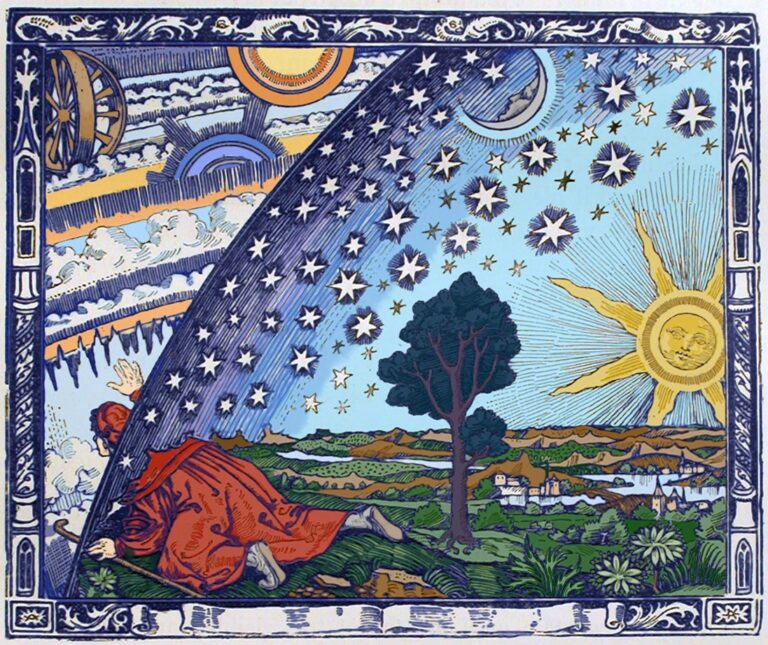
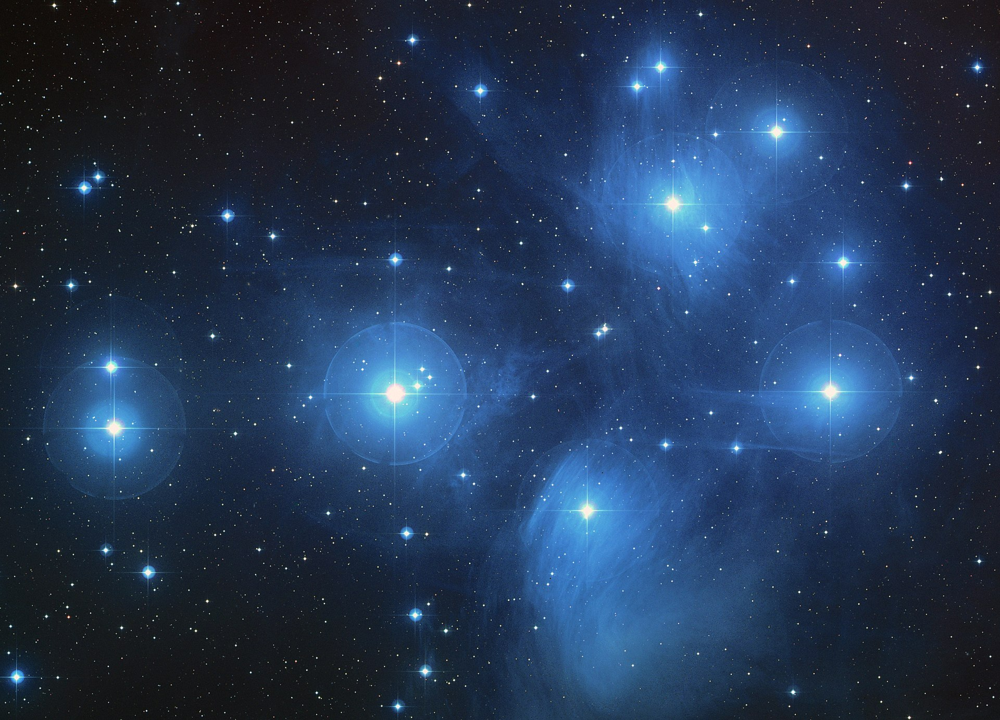

_This post was the script to the final talk in my Astronomy 101 lecture series originally presented on September 12, 2021. Although there is no video of thet alk and I don't plan on making one available, here is the script that I put together for that night. Parts of it were heavily borred from Neil deGrasse Tyson's "Cosmos: A Spacetime Odyssey" and I acknowledge that here. I claim no rights to those parts._

Over these past few weeks, we have discussed some big ideas. We’ve explored to the furthest reaches of the Universe and through the vast eons of time. That often leaves people feeling tiny and insignificant, even small. Well, in the context of the cosmos, we are small!

But the thing is, we may just be little guys living on a speck of dust, afloat in a staggering immensity, but we sure don’t think small. In all our lives, there comes a time when we first realize that we aren’t the center of the Universe, that we belong to something much greater than ourselves. It’s part of growing up. And as it happens to each of us, so it began to happen to our civilization in the sixteenth century.

Imagine a world before telescopes, when the Universe was only what you could see with the naked eye. It was obvious that the Earth was motionless and that everything in the heavens—the Sun, the Moon, the planets, the stars—revolved around us. But then a Polish astronomer and priest named Nicolaus Copernicus made a radical proposal: the Earth was not at the center. It was just one of the planets, and, like them, it revolved around the Sun.

Many religious figures, like the Protestant reformer Martin Luther, took this idea as a scandalous affront to Scripture. They were horrified! But for one man, Copernicus didn’t go far enough. His name was Giordano Bruno. He longed to bust out of that cramped little universe. Even as a young Dominican monk in Naples, he was a rebel. Bruno hungered to know everything about God’s creation. He dared to read books banned by the Church and that was his undoing. In one of them, an ancient Roman, a man already dead for more than 1500 years, whispered to him of a universe far greater, one as boundless as his idea of God. 

Lucretius, in his book "On the Nature of Things," asked the reader to imagine standing at the edge of the universe and shooting an arrow outward. If the arrow keeps going, then clearly the universe extends beyond what you thought was the edge. But if the arrow doesn’t keep going and hits a wall instead, then that wall must lie beyond what you thought was the edge of the universe. Now if you stand on _that_ wall and shoot another arrow, there are only the same two possible outcomes: it either flies forever out into space or it hits some boundary where you can just stand and shoot yet another arrow.

Either way, the Universe is unbounded. The cosmos must be infinite. This made perfect sense to Bruno. The God he worshiped was infinite, so how, he reasoned, could Creation be anything less? These heretical ideas were his undoing. When he learned an indictment was being prepared against him by his monastery in Naples, he fled the city. That would be the last steady job he ever had.

And then, when he was only 30, he had the vision that sealed his fate. In his dream, he awakened to a world enclosed inside a confining bowl of stars. This was the cosmos of Bruno’s time. As he walked to the edge of this universe, Bruno experienced a sickening moment of fear, as if the bottom of everything was falling away beneath his feet. 

But he summoned up his courage. 

> "I cleave the heavens and soar to the infinite.
And while I rise from my own globe to others
And penetrate ever further through the eternal field,
That which others saw from afar, I leave far behind me." 
--Giordano Bruno, _"On the Infinite Universe and Worlds"_, 1584

<figure>
L'Atmosphere: M&eacute;t&eacute;orologie Populaire</em> by Camille Flammarion. The illustration is of a dome of stars with a landscape underneath it. A man has his head stuck out of the dome looking up at the universe beyond." style="width:350px;height:auto"/>
<figcaption>Camille Flammarion, <em>L'Atmosphere: M&eacute;t&eacute;orologie Populaire</em> (Paris, 1888), p. 163. Colorized by Susanna J. Magruder. Courtesy History of Science Collections, University of Oklahoma Libraries.</figcaption>
</figure>

The revelation of this immensity was like falling in love. Bruno became an evangelist, spreading the gospel of infinity throughout Europe. He assumed that other lovers of God would naturally embrace this grander and more glorious view of Creation.

Instead, he was excommunicated by the Roman Catholic Church in his homeland, expelled by the Calvinists in Switzerland and by the Lutherans in Germany. Eventually, Bruno found a brief lectureship at Oxford University where he could freely spread his view on infinity. However, even there his views were controversial. George Abbot, then Vice-Chancellor of the University and later Archbishop of Canterbury, mocked Bruno for supporting "the opinion of Copernicus that the Earth did go round, and the heavens did stand still; whereas in truth it was his own head which rather did run round, and his brains did not stand still." A wiser man would have learned his lesson, but Bruno was not such a man.

He couldn’t keep his soaring vision of the cosmos to himself, despite the fact that the penalty for doing so in his world was the most vicious form of cruel and unusual punishment. Giordano Bruno lived at a time when there was no such thing as the separation of church and state or the notion that freedom of speech was a sacred right of every individual.

Recklessly, Bruno returned to Italy. Maybe he was homesick, but still, he must have known that his homeland was one of the most dangerous places in Europe he could possibly go. It wasn’t long before Bruno fell into the clutches of the Catholic Church. This wanderer, who worshiped an infinite universe, languished in confinement for eight years. Through relentless interrogations, he stubbornly refused to renounce his views.

Why was the Church willing to go to such lengths to torment Bruno? What were they afraid of? If Bruno was right, then the sacred books and the authority of the Church would be open to question.

Finally, the charges were brought. Among them were: holding opinions contrary to the Catholic faith about the Trinity and divinity of Christ; regarding the virginity of Mary, mother of Jesus; pertaining to Jesus as Christ; and claiming the existence of a plurality of worlds and their eternity. Once again, Bruno refused to recant his claims.

On January 20, 1600, Pope Clement VIII declared Bruno a heretic and the Inquisition sentenced him to death. "Perhaps you pronounce this sentence against me with greater fear than I receive it," Bruno responded.

Ten years after Bruno’s martyrdom, Galileo first looked through a telescope, realizing that Bruno had been right all along. The Milky Way was made of countless stars invisible to the naked eye, and some of those lights in the sky were actually other worlds.

Bruno was no scientist. His vision of the cosmos was a lucky guess because he had no evidence to support it. Like most guesses, it would well have turned out to be wrong. But once the idea was in the air, it gave others a target to aim at.

And over the past several weeks, we too have soared through the infinite. We have left the Earth for the furthest reaches of space. Our nearest neighbor, the Moon, has no sky, no ocean, no life. Just the scars of cosmic impacts. Our star, the Sun, powers all the wind, waves, and life on the surface of our little world. It also holds all the worlds of the solar system in its gravitational embrace, starting with hot and fast-footed Mercury to cloud-covered Venus, where a runaway greenhouse effect has turned it into a kind of hell.

The red planet Mars is a world that has interested humanity for centuries. And despite it being the most explored planet, it still holds mysteries for us. A belt of rocky asteroids circles the Sun between the orbits of Mars and Jupiter. It is also host to the dwarf planet Ceres, the only spherical body in the belt, but still only 7% the size of Earth. 



With its four giant moons and dozens of smaller ones, Jupiter is like its own little solar system. Its Great Red Spot is a hurricane three times the size of our whole planet that’s been raging for centuries. The crown jewel of the solar system, Saturn, is ringed by freeways of countless orbiting and slowly tumbling snowballs. Uranus and Neptune, the outermost planets, were unknown to the ancients and only discovered _after_ the invention of the telescope. Beyond the outermost planet, there is a swarm of tens of thousands of frozen worlds, and Pluto is one of them.

The deepest waters of the vast cosmic ocean and their numberless worlds lie ahead. From out here, the Sun may look like just another star. _How many stars? How many worlds?_ We live in the Milky Way Galaxy in a trailing outer arm about 30,000 lightyears from the center of our grand spiral. Our galaxy is part of a few dozen in our Local Group, including our nearest neighbor the Andromeda Galaxy. But even then, we are just one of thousands of galaxies in the Virgo supercluster. Each galaxy contains billions of suns and countless worlds. Yet the entire Virgo superlcuster itself forms a tiny fraction of our Universe. 

But the Universe is not only immense in size, it is also staggeringly immense in time. How can we humans, who rarely live as long as a century, hope to grasp the 13.8 billion year history of the cosmos?

Let’s compress it into a single calendar year. The Cosmic Calendar begins on January 1st with the birth of our Universe and ends with the present day on December 31st. On this scale every month represents about a billion years and every day about 40 million years.

Let’s go to January 1st, the Big Bang. Our entire Universe came into being from a point smaller than a single atom. Space itself exploded in a cosmic fire, launching the expansion of the Universe and giving birth to all the matter and energy we know today. Recently, I showed you the strong observational evidence to support the Big Bang: the amount of helium and deuterium in the cosmos and the glow of the cosmic microwave background radiation. 

As it expanded, the Universe cooled, and there was darkness for about 200 million years. Gravity was pulling together clumps of gas and heating them until the first stars burst into light on January 10th. On January 13th, these stars coalesced into the first small galaxies. These galaxies merged to form still larger ones, including our own Milky Way, which formed about 11 billion years ago on March 15th of the cosmic year.

As these galaxies formed, stars flashed each time they ran out of fuel in a supernova. These supernovae would disturb nearby clouds of gas and star would start condensing out of them like raindrops. Stars get so hot that the nuclei of atoms fuse together deep within them to make the oxygen we breathe, the carbon in our muscles, the calcium in our bones, and iron in our blood; all of it was cooked in the fiery hearts of long-vanished stars. You, me, everyone and everything, is made of star stuff. This star stuff is recycled and enriched, again and again, through succeeding generations of stars.

How much longer until the birth of the Sun? A long time. It won’t begin to shine for another six billion years. Our Sun’s birthday is August 31st on the Cosmic Calendar, about 4.5 billion years ago. As with the other worlds of the solar system, Earth was formed from a disk of gas and dust orbiting the newborn Sun. Repeated collisions produced a growing ball of debris. The Earth took one hell of a beating in its first billion years. Fragments of orbiting debris collided and coalesced until they snowballed to form the Moon; a souvenir of that violent epoch.

As the Earth cooled, seas began to form. Life began here, on September 21st, 3.5 billion years ago on our little world. We still don’t know how life got stared. The origin of life is one of the greatest unsolved mysteries of science. Regardless of how it started, on November 9th, life was breathing, moving, eating, responding to its environment.

December 17th was quite a day. Life in the sea really took off, exploding with a diversity of larger plants and animals. Forests, dinosaurs, birds, insects, they all evolved in the final week of December. The first flower bloomed on December 28th. As these ancient forests grew and died and sank beneath the surface, their remains transformed into coal, which we use to power and imperil our civilization.

Then at 6:24 AM on December 30th, an asteroid collided with what would later be Mexico and wiped out the dinosaurs, the lords of the Earth. Still no signs of us.

In the vast ocean of time that this calendar represents, we humans have only evolved within the last hour of the last day of the cosmic year. All of recorded history occupies only the last 14 seconds, and every person you’ve ever heard of lived somewhere in there. All those kings and battles, migrations and inventions, wars and loves, everything in the history books happened here.

It’s 9:45 on New Year’s Eve. Three and half million years ago, our ancestors stood up on two feet and suddenly our eyes were no longer fixed on the ground. Now we were free to look up and wonder. We’re so young on the timescale of the Universe that we didn’t start painting our first pictures until the last 60 seconds of the cosmic year, a mere 30,000 years ago. This is when we invented astronomy. In fact, we’re all descended from astronomers. Our survival depended on knowing how to read the stars in order to predict the coming of the winter and the migration of the wild beasts. 

And then, around 10,000 years ago, there began a revolution in the way we lived. Our ancestors learned how to shape their environment, taming wild plants and animals, cultivating land and settling down.

This changed _everything_. For the first time in history, we had more stuff than we could carry. We needed a way to keep track of it. At 14 seconds to midnight, or about 6,000 years ago, we invented writing. Writing allowed us to save our thoughts and send them much further in space and time. Tiny markings on a clay tablet became a means for us to vanquish mortality. It shook the world.

Moses was born 7 seconds ago; Buddha, 6 seconds ago; Jesus, 5 seconds ago; Mohammad, 3 seconds ago. It was not even 2 seconds ago that, for better or worse, the two halves of the Earth discovered each other. And it was only in the very last second of the Cosmic Calendar that we began to use science to reveal nature’s secrets and her laws. The scientific method is so powerful that in a mere four centuries, it has taken us from Galileo’s first look through a telescope at another world to leaving our footprints on the Moon. It allowed us to look out across space and time to discover where and when we are in the cosmos. _We are a way for the cosmos to know itself._

And we have come to know it well not only as a scientific endeavor, but as a human endeavor too. A long time ago, in a world lit only by fire, our relationship with the stars was far more personal. Night after night, we watched the stars. In a time when our imaginations were the only stage where stories came to life, before there were movies or TVs or electronic devices of any kind, every human culture connected the dots to form their own pictures.

These images became the illustrations of a storybook that, on a deeper level, was also a survival manual. The names and personalities of the gods, heroes, farm animals, or familiar objects varied from culture to culture. But there was one particularly gorgeous group of stars known to the ancient Greeks and to us today as the Pleiades, a star cluster that formed about 100 million years ago (2.5 days on the Cosmic Calendar). Each of the stars in the Pleiades is some 40 times brighter than our Sun, and the brightest, Alcyone, outshines our Sun 1,000 times. 

<figure>

<figcaption>The Pleiades in Taurus Digitized Sky Survey, 2004</figcaption>
</figure>

For ages, the Pleiades have been used as an eye test for people all over the world. If you could see six of them, you were considered normal. If you saw more than seven, you were an ideal candidate for a warrior or scout.

Among the ancient Celts and druids of the British Isles, the Pleiades were believed to have a haunting significance. On the night of the year that they reach the highest point in the sky at midnight, the spirits of the dead were thought to wander the Earth. This is believed to be the origin of the holiday once known as Samhain, now called Halloween.

All over the Earth, our ancestors told wonderful stories to explain how the Pleiades came to be in the sky. For the Kiowa people of North America, it happened something like this. 

> Long, long ago, some young women snuck away from camp one night to dance freely beneath the stars. It wasn’t long before some bears discovered them and chased them through the wilderness. Eventually, the girls found a tall rock and climbed it. The girls begged the spirits in the rock to save them. The rock heard their cries and grew taller until it became what is today known as Devils Tower. The maidens were transformed into the stars of the Pleiades, which may be seen hanging above the tower in mid-winter.

The ancient Greeks also saw those seven jewels as seven maidens, the seven daughters of Atlas, pursued not by bears, but by Orion the hunter, who spied them while out walking one day. Orion became mad with desire and chased them relentlessly. Exhausted, the maidens prayed to Zeus for deliverance. Zeus felt sorry for them and transformed those seven maidens into the Pleiades. But the gods are, if anything, capricious. When Orion was killed by the sting of a scorpion, Zeus placed him the sky where he could resume his pursuit of the seven gorgeous sisters.

Our ancestors wove brilliantly imaginative stories, but they can bring us no closer to the stars than our dreams. It took yet another few thousand years until three scientists unlocked the true lives of stars.

In 1901, Harvard University was a man’s world, but astronomer Edward Pickering broke that rule. He assembled a team of women to map and classify the types of stars. One of them provided the key to our understanding of the substance of the stars. And another devised a way for us to calculate the size of the Universe. Outside of these talks, you’ve probably never heard of them. Wonder why.

The leader of the team was Annie Jump Cannon. Before she was through, she cataloged a quarter of a million stars. Cannon was also deaf; she lost her hearing during a bout of scarlet fever when she was a young woman. Another teammate was Henrietta Swan Leavitt who was also deaf. She discovered a law we’ve talked about that astronomers still use more than a century later to measure the distances to the stars and the size of the cosmos itself.

Annie Jump Cannon sent out a Christmas card in 1915 explaining what she and her teammates were doing: 

> "The light from the star is allowed to fall through a prism placed in the telescope and, thus magnified, is split up into a band showing its component colors, the red rays going to one end, and the violet to the other. This is the spectrum of the star. The photograph does not show the colors, but, what is more important, it does show the presence of fine dark lines, few in some spectra and numerous in others. These wonderful dark lines have become a veritable happy hunting ground for the modern astronomer. By comparing them with lines given by glowing substances in his own laboratory, he can also determine that the same elements familiar to us on the earth also exist in the outermost star."  --Annie Jump Cannon, 1915

It took Cannon decades to classify the spectral character of hundreds of thousands of stars according to the scheme that she devised. Cannon discovered that the stars fell into a continuous sequence of seven broad categories according to their spectral line patterns, OBAFGKM. But the spectral lines of two stars in the same class could differ in subtle ways, minute variations that Cannon learned to recognize from memory. To distinguish these spectra from one another, she assigned ten numerical subcategories for each class, 0-9. Our Sun is a G2 star. Annie Jump Cannon organized the stars, but it would fall to another scientist to decipher the hidden meaning of her work. 



In the England of 1923, women were forbidden from pursuing advanced degrees in science. But Cecilia Payne had attended a lecture in London by the astronomer Sir Arthur Eddington, the first scientist to provide evidence that Einstein’s Theory of General Relativity was correct. From that moment on, she knew that nothing would deter her from pursuing her big dreams. She resolved to emigrate to America where women had already gained the freedom to study the stars. Payne applied to and was accepted to Harvard. What she would discover there would challenge one of the central beliefs of astronomy and be the start of modern astrophysics.

As the decades passed, Annie Jump Cannon and her team kept sifting the stars, checking each one’s spectral signature with a fleeting glance and then dropping them into one of several categories. They became hundreds of thousands of dots in a larger picture which no one could understand.

Into this community of women came Cecilia Payne and she experienced kindness in a setting that is often unkind to women. The sisterhood generously shared the fruits of their labor with her, and she turned their observations into a radical new understanding of the stars. Cannon taught Payne everything she had learned about stellar spectra, and Payne began to analyze Cannon’s data to see if she could determine the actual chemical and physical state of the stars. She brought to this work her expertise in theoretical and atomic physics. 

The most prominent features in the spectra of stars showed the presence of heavy elements such as calcium and iron, which are among the most abundant elements in the Earth. Astronomers naturally concluded that the stars were made of the same elements as the Earth and in roughly the same proportions. Among these astronomers was Henry Norris Russell who was also Payne’s thesis advisor.

When Payne was working on her thesis, she realized that Cannon’s classification scheme was actually telling her what temperature the star is. Furthermore, she discovered that stars are made almost entirely of hydrogen and helium. There’s a million times more hydrogen and helium than the metals in the stars. Payne said as much in her thesis which she handed in to Russell.

Russell felt sorry for Payne. Her thesis appeared to him to be fundamentally flawed. It is _clearly_ impossible that hydrogen should be a million times more abundance than the metals. Her carefully gathered evidence flew in the face of conventional scientific wisdom. Despite her confidence in the quality of her research, she caved and added a sentence to her thesis that undermined its greatest insight:

> "The outstanding discrepancies between the astrophysical and terrestrial abundances are displayed for hydrogen and helium. The enormous abundance derived for these elements in the stellar atmosphere _is almost certainly not real._"  --Cecilia Payne, _"Stellar Atmospheres,"_ 1925

It would be four years before Russell realized that Payne was right. To his credit, as soon as he did, he acknowledged that it was her discovery. Payne’s thesis is widely regarded as the most brilliant PhD thesis ever written in astronomy. It became the standard text in its field. Cecilia Payne’s interpretation of Annie Jump Cannon’s sequence of stellar spectra made it possible for us to read the life stories of the stars and to trace the story of life itself back to its beginnings in their fiery deaths.

Now, I tell you that story because I want to illustrate my view of the Universe, what I see when I look up into the night sky. There’s that semi-famous quote from Neil deGrasse Tyson, “I look up at the night sky, and I know that, yes, we are part of this Universe, we are in this Universe, but perhaps more important than both of those facts is that the Universe is in us. When I reflect on that fact, I look up—many people feel small, because they’re small and the Universe is big, but I feel big, because my atoms came from those stars.” That is a great thought to have and it certainly helps with settling some existential fears people might have.

However, I take a different approach, a more humanistic approach. When I look up at the night sky, I see the constellations, the planets, the stars, but I also see the many men and women who have worked to uncover the truths of those objects. I see Annie Jump Cannon at her desk at Harvard pouring over thousands of photographic plates to bring a sense of order to the countless stars. I see Cecilia Payne tirelessly working on a thesis she knows is right but one that flies in the face of conventional wisdom.

And I didn’t have to tell you their stories tonight. There are hundreds of other stories like theirs that I see. I see Ptolemy working in vain to make the planets orbit on perfect circles. I see Kepler figuring out for the first time that those orbits are actually ellipses. I see Shapley and Curtis arguing over the nature of spiral nebulae and Hubble coming along and telling us that not only is the Universe bigger than we believed, it is weirder than we believed. I see Vera Rubin discovering dark matter, I see Jocelyn Bell Burnell discovering pulsars. Einstein, Newton, Galileo, Halley, Chandrasekhar, Eddington, Herschel, Leavitt, and countless nameless others. “If I have seen further it is by standing on the shoulders of giants.”

I can see further because these people, each with their own stories, have longed to make sense of the Universe, to make sense of objects they can never touch, taste, smell, or hear but only look up at and dream. And in return, they have given us their knowledge, yes, but have also given us their dreams and stories. So when I look up at the night sky, I feel big because I see the countless thousands of people who have come before me and wondered the very same things than I wonder.

And although we have been concerned with the science these past several weeks, I hope that I have instilled in each of you that astronomy isn’t just a branch of science, it is also a way to tell the human story.

Tonight, I want to end by telling you one last story. The longest odyssey of all history was launched back in 1977, NASA’s _Voyager 1_ and _2_ missions. They gave us our first close-up look at Jupiter’s Great Red Spot, and discovered the first active volcano on another world, on the moon Io, and an ocean beneath the icy surface of the moon Europa with at least twice as much water as we have here on Earth. The _Voyagers_ dared to fly across Saturn’s rings and revealed that they were made of hundreds of thin bands of orbiting snowballs. _Voyager 2_ gave us our first portrait of the outermost planet, Neptune, where winds roar at 1000 miles per hour. _Voyager_ successfully completed its mission of discovery to the outer planets, but its odyssey was just beginning as they breached the uncharted waters of interstellar space.

Twenty-six centuries ago, the Assyrian king Esarhaddon wrote

> "I had monuments made of bronze and inscriptions of baked clay.
I left them in the foundations for future times."  --Esarhaddon, 7th century BCE

Carl Sagan similarly recognized that the _Voyager_ mission offered two free tickets to something approaching eternity. He assembled a small team to create a message to any civilization that might, one day, encounter the derelict spacecraft. 

And what did they come up with? A golden record with a projected shelf life of a billion years. Become an extraterrestrial archaeologist for a few moments. An artifact has been fished out of the interstellar ocean. It was made by beings that lived about a billion years ago. What would you make of them and their world? They’ve sent us their music and greetings in 59 human languages. And one whale language. And a sound essay that includes a Saturn V rocket launch, a mother’s first words to her newborn baby, and the sound of a pulsar.

In and amongst the usual suspects of Bach, Beethoven, and Mozart is an odd little tune, recorded in 1927 by a Texan preacher and street-corner blues singer, Blind Willie Johnson. Born in 1897, he knew from a young age that he wanted to be a preacher. He did not falter in his devotion to God and what he felt was his calling, despite being blinded when his stepmother threw lye in his face for his father’s infidelities.

Johnson made money playing music on the street and was eventually found by a field unit of Columbia Records. Between 1927 and 1930, Johnson recorded 30 titles for Columbia for which he was probably paid $25-$30 per song. Although he was successful for a time, when the Great Depression hit, Johnson found himself playing music on the street for money again. He did in 1945 at the age of 48 from pneumonia which he got from sleeping in the wet remains of his burned down home. 

That song that Sagan and his team picked? A hymn, [“Dark Was the Night, Cold Was the Ground,”](https://www.youtube.com/watch?v=BNj2BXW852g) a wordless melody consisting only of Johnson’s slide guitar and his resonant, gospelly, moaning hum. Sagan picked it because “Johnson’s song concerns a situation he, and humanity, have faced many times: nightfall with no place to sleep.”

What can we say about the far off future the _Voyager_ spacecraft will find themselves in? The only thing we can say is that something of who we were and the music that represents us, that we made in that long ago spring, will live on. And the human story will live on through the song of a blind man who could only dream of laying down at night and looking up at the stars. 